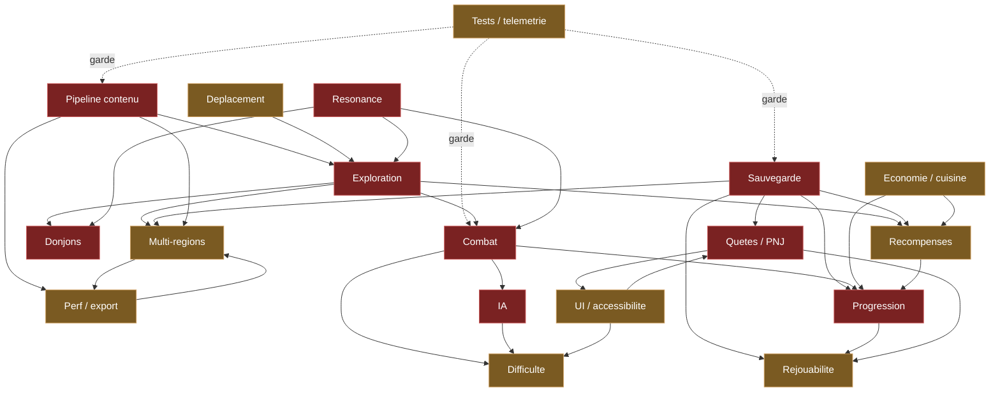

# AUDIT — la V2 face à 30-50 h / 80-120 h / 200 h+

Statut : **VIVANT — COMPLET.** Date : 2026-08-27.
Autorité amont : `docs/V2_PRODUCT_DOCTRINE.md` (l'ambition),
`docs/V2_LONG_GAME_ROADMAP.md` (l'ordre et le coût).

## Comment cet audit a été produit

Dix-huit domaines, un auditeur par domaine, **puis un sceptique par domaine**
chargé non de confirmer mais d'attaquer les notes « fonctionnel » : un fichier
présent n'est pas une preuve d'exécution, et un test dont le nom évoque le
sujet n'en est pas une s'il ne teste qu'une construction d'objet.

**Les dix-huit sceptiques ont tous rendu `à corriger`.** Ensemble ils relèvent
**68 surclassements** et **139 omissions**. Aucun audit n'est passé indemne,
et c'est le résultat attendu : une revue qui confirme tout ne sert à rien.

Vocabulaire du dépôt, contraignant :

| Mot | Ce qu'il exige |
|---|---|
| `fonctionnel` | testé dans une scène exécutable — **preuve nommée obligatoire** |
| `présent` | existe et est raccordé, sans preuve d'exécution |
| `prototypé` | existe en placeholder, ou sans raccordement |
| `ABSENT` | rien |

---

## LE FAIT QUI DOMINE TOUT, vérifié à la main par le lead

**Depuis « Nouvelle partie », zéro heure de campagne est atteignable
aujourd'hui.**

Ce n'est pas une opinion d'agent. Je l'ai vérifié moi-même, commande par
commande, avant de le publier :

| Vérification | Résultat |
|---|---|
| `grep -rn "SceneDoor" scripts/world_v2/ scenes/world_v2/` | **aucune occurrence** |
| `scripts/ui/main_menu.gd:14` | `WORLD_SCENE = "res://scenes/world_v2/WorldV2.tscn"` |
| Chemins de retour vers `ValleyWorld.tscn` (V1) | **4** : `victory_screen.gd:18`, `gameplay_shell.gd:22`, `citadel_vestibule.gd:170`, `reward_anchor_shot.gd:20` |
| Contrat « acteur prématuré » | `test_world_v2_places_contract.gd:251` — **interdit les acteurs** |
| Appels `tr(` réels dans `scripts/` | **zéro** ; aucun fichier de traduction ; aucune section d'internationalisation |

Le menu ouvre World V2. World V2 n'a aucune porte vers le donjon. Les quatre
retours pointent vers un monde que le menu n'ouvre plus. **Le donjon, le boss,
l'antichambre, le coffre final et l'écran de victoire sont inatteignables par
le chemin joueur normal.**

Douze des dix-huit audits ont buté sur ce défaut depuis leur propre angle sans
qu'aucun puisse voir qu'il s'agissait du même. C'est la valeur d'une synthèse
transversale, et c'est aussi son avertissement : **aucune mesure de durée de
campagne n'est possible tant que la boucle est ouverte**, ce qui invalide en
amont le dimensionnement de tout le reste.

Coût estimé de la correction : **faible** — une porte, quatre constantes.
Effet : **total**. C'est la meilleure affaire de tout cet audit.

---

## Le socle chiffré, mesuré indépendamment des agents

Aucun nombre de cette section ne vient d'un sous-agent
(`tools/mesures_socle.py`).

| Grandeur | Mesure |
|---|---:|
| Sujets déclarés au layout | **34** (31 POI + 3 sites) |
| Lieux montés dans le REGISTRY | **15** |
| Déclarés et NON construits | **21** |
| Achèvement de la région 1 | **44 %** |
| Chantier World V2 | 2026-08-12 → 08-27, **723 commits** |
| dont touchant un fichier de lieu | **355 (49 %)** |
| Coût médian d'un lieu | **24 commits** (min 15, max 45) |
| `class_name` dans `scripts/` · autoloads | **164** · **6** |

**Sondes de présence.** Un `grep quest` rend treize fichiers ; ils matchent
tous `request`. La sonde cherche donc des `class_name` déclarés **plus les
autoloads**, qui n'ont jamais de `class_name`.

**ABSENTS** — quêtes · dialogues · PNJ · new game + · streaming de région ·
artisanat · économie · météo.
**PRÉSENTS** — cuisine · sauvegarde · résonance · réactions · graphe
électrique · boss · IA utilitaire · inventaire · état de jeu.

### Ce qu'aucun audit ne peut établir depuis ce conteneur

- **Aucun temps de jeu réel n'a jamais été mesuré.** Toute heure citée ici est
  un raisonnement, pas une observation.
- Fluidité, frame budget, hitchs : impossibles — pas de GPU, et l'horloge du
  moteur est décrochée du temps mural d'un facteur 17 à 76 (ISS-072).
- Le ressenti — plaisir, clarté, injustice — appartient au playtest humain.

---

## Synthèse transversale

## 1. VERDICT GLOBAL

Ce projet possède un appareil d'ingénierie sérieux — 967 tests, portails à contrôle négatif, gel sha256, parité build-exportée — posé sur une verticale de démonstration d'environ quarante minutes, et il vient de reconstruire son monde sans y rebrancher son contenu. Le jeu réellement livré au joueur (`WorldV2.tscn`) est un cul-de-sac mesuré : aucune porte de scène, aucun ennemi, aucune persistance, treize lieux montés sur trente-quatre déclarés, dans un disque jouable de 0,173 km² traversé en environ cinq minutes de course cumulée — donc **zéro heure de campagne est aujourd'hui atteignable depuis « Nouvelle partie »**, ce que douze des dix-huit audits ont constaté indépendamment depuis leur angle sans que personne puisse voir qu'il s'agissait d'un seul et même défaut. Face à 30-50 h, l'écart n'est pas un retard : c'est un changement d'ordre de grandeur sur la surface (×60 à ×230), sur le peuplement (0 ennemi contre plusieurs centaines de rencontres), sur la narration (zéro quête, zéro PNJ, zéro dialogue, environ huit phrases de fiction dans tout le jeu) et sur la progression (les cinq pouvoirs sont donnés à la première frame, six armes fixes, aucun verrou d'acquisition, aucun respawn). Le motif dominant du dépôt n'est pourtant pas l'incompétence ni le bluff — c'est la **construction de moteurs corrects que personne ne câble ensuite au contenu** : le moteur d'IA n'a aucun ennemi à jouer, le Bracelet de Résonance n'a que deux cibles dans le monde livré et zéro dans le donjon et le boss, `GameState.Difficulty` n'a aucun consommateur, `playtime_seconds` n'est jamais incrémenté. La bonne nouvelle est proportionnelle : la plupart de ces défauts sont des **câblages manquants à coût faible**, pas des réécritures — mais chaque lieu construit avant qu'ils soient posés devra être repris.

---

## 2. LE GOUFFRE

Huit manques, classés par gravité décroissante. Un défaut n'est ici « au-dessus » d'un autre que s'il invalide sa mesure.

### G1 — La boucle est ouverte dans le build livré. `0 h` atteignable.
`scripts/ui/main_menu.gd` ouvre `WorldV2.tscn` pour « Continuer » comme pour « Nouvelle partie ». Il n'existe **aucune** `SceneDoor` sous `scripts/world_v2/` (vérifié) ; le seuil `dungeon_gate` est un `Node3D` nu posé par `world_v2_markers_builder.gd`. La seule porte vers `CitadelVestibule.tscn` vit dans `scripts/world/valley_terrain.gd`, monde V1 que le menu n'ouvre plus. Symétriquement, **quatre** chemins de retour pointent encore vers `ValleyWorld.tscn` (`victory_screen.gd::VALLEY_SCENE`, `citadel_vestibule.gd::exit_door.target_scene`, `gameplay_shell.gd::world_scene_path` par défaut, `reward_anchor_shot.gd`). Conséquence : donjon, boss, antichambre, coffre final et écran de victoire sont inatteignables, et **aucune mesure de durée de campagne n'est possible**, ce qui invalide en amont tout dimensionnement des sept autres manques. Coût de correction estimé : faible (une porte, quatre constantes). Effet : total.

### G2 — Zéro quête, zéro PNJ, zéro dialogue, zéro localisation.
Mesuré : aucun `QuestDefinition`, aucun script de PNJ (`scenes/characters/` = 1 héros + 5 ennemis), aucun système de dialogue, **zéro appel `tr()`** dans `scripts/`, aucun fichier de traduction, aucune section d'internationalisation dans `project.godot`. Toute la fiction du jeu tient dans **4 fragments d'histoire de deux phrases** codés en dur dans la constante `DiscoveryRewards.PLAN`, livrés dans un toast de 3 secondes qu'aucun écran ne permet de relire. Le monde nomme quatre lieux habités — village, hameau, poste minier, caravane — que personne n'habite. Ordre de grandeur pour 30-50 h : **60 à 120 objectifs suivis, 15 à 30 PNJ par région, 30 000 à 80 000 mots** (estimation de ma part). La localisation doit précéder l'écriture : externaliser 50 000 mots après coup coûte plusieurs fois le prix.

### G3 — Le monde a la taille d'un pilote, et rien ne prévoit le suivant.
0,173 km² jouables (`PLAYABLE_RADIUS_M = 235`), 1 797 m de routes cumulées ≈ 5 min de course, 35,5 m d'amplitude verticale, 13 sujets montés sur 34 déclarés, 1 grotte-poche de 8 m de plafond, 2 intérieurs. Et surtout : **trois verrous écrits exprès referment la porte du multi-région** — `WorldV2Layout.CANONICAL_POI_IDS` refuse tout POI hors des 31 littéraux de Néris, `WorldV2Heightmap._fields()` encode la géographie en constantes réglées à la main, l'anneau de 36 gardes `unclimbable` est contractuellement sans brèche. S'y ajoutent **trois emprises divergentes** codées en dur (235,0 / 233,0 / 246,0) et **quatre tables par région** en GDScript. Aucun streaming : les 64 chunks, la végétation, les lieux et l'atmosphère sont bâtis en une passe dans `_ready()`, et `SceneFlow.go_to()` ne sait que remplacer la scène.

### G4 — Zéro adversaire dans le jeu livré, et le vide est verrouillé par un test vert.
`grep` confirmé : aucune référence à `scenes/enemies/`, `EnemyBase` ou `CombatCoordinator` sous `scripts/world_v2/`. Le conteneur `Encounters` est exigé par la racine puis jamais rempli. Douze à treize instances d'ennemis existent dans tout le dépôt, **toutes dans le monde V1**. Aucun respawn (« pas de respawn, un ingrédient récolté reste récolté »), aucun `LootComponent`, aucune `LootTableDefinition` : tuer ne rapporte rien, et le contenu de combat d'une partie est fini et consommable une fois. Le donjon lui-même se traverse sans un seul adversaire avant le boss. Le boss expose **3 patterns** au total, dont 2 légaux pendant 70 % de sa barre de vie. Les cinq armes de mêlée partagent **littéralement** les mêmes trois `AttackDefinition` légères.

### G5 — Aucune progression, à aucune échelle.
Les cinq opérations du Bracelet sont disponibles à la première frame : **aucun `has_ability`, aucun `is_unlocked`, aucun verrou de monde** dans `scripts/`. Les six définitions d'armes du départ sont celles de la fin, redistribuées onze fois sur trente et un lieux depuis un dictionnaire codé en dur ; `rarity` et `attack_speed` sont exportés et lus par zéro script. PV et endurance maximale sont des constantes que rien n'augmente. Le seul axe d'acquisition durable compte **trois** Fragments facultatifs — et ils ne sont posés que dans le monde V1, donc inatteignables. Sans registre d'acquisition, la règle qui devait porter les 80-120 h de complétion (« une capacité nouvelle rouvre l'ancien monde ») **n'a aucun support technique**, et ce registre est rétroactif : chaque lieu construit sans lui devra être repris pour poser ses verrous.

### G6 — Le monde livré ne persiste rien.
Aucun appel à `save_slot`, `load_slot` ou `has_save` sous `scripts/world_v2/`. « Continuer » lit le fichier **uniquement pour vérifier qu'il est lisible**, puis repose le joueur au spawn canonique, les mains vides, tous les coffres refermés, le `DiscoveryLog` recréé neuf. Le moteur de sauvegarde, lui, est bon (écriture atomique, schéma versionné, refus d'un schéma futur et d'un fichier corrompu, fusion par clé) — mais tout son câblage vit dans `valley_world.gd`, `scripts/dungeon/` et `scripts/boss/`. Un seul slot `slot0` codé en dur dans cinq scripts, aucune sauvegarde manuelle, aucune sauvegarde à la fermeture, `.bak` écrit et jamais relu. Tant que ce point tient, **toute mesure de progression faite sur le pilote est fausse**.

### G7 — Le débit de production ne tient pas l'échelle, et son coût de preuve explose.
Mesuré : 10 501 lignes de GDScript dans `scripts/world_v2/poi/` pour 14 lieux, soit **~750 lignes de géométrie procédurale écrite à la main par lieu**, contre 512 lignes de kit partagé. Aucun gabarit de lieu, aucun format de région, quatre navmesh cuits à la main, **zéro LOD dans tout le dépôt** (aucun `visibility_range`, aucun `_LOD1`, aucun `OccluderInstance3D`), **138 textures sur 138 sans compression VRAM** et 97 sur 138 sans mipmaps. Le coût de contenu par lieu est stable (~13 commits hors `evidence/`) mais le coût de **preuve** explose : de 12-21 fichiers touchés par lieu au lot pilote à 83-102 au lot 1.R, presque tous dans `evidence/`, soit ~100 Mo de preuve par lieu versés définitivement à l'historique. Aujourd'hui : `evidence/` = 1,8 Go, `size-pack` = 1,78 Gio, et **53 % des fichiers versionnés du dépôt sont des preuves, pas du jeu**.

### G8 — « 30-50 h » n'est adossé à aucune mesure.
`docs/PERFORMANCE.md` s'ouvre sur « Aucune mesure n'a été effectuée à ce jour » et n'a pas bougé depuis le 4 août. `docs/STATUS.md` écrit qu'aucun temps de jeu réel n'a jamais été mesuré sur ce projet. `playtime_seconds` est écrit à `0.0` par ses deux seuls écrivains et jamais incrémenté. Aucune télémétrie de gameplay : la boîte noire n'enregistre que position, vie, endurance, saccades et notifications — **rien** des dix familles d'événements exigées (mort et cause, durée de rencontre, POI visité, arme utilisée, softlock détecté). Le projet ignore donc si sa région pilote complète vaut 40 minutes ou 4 heures, c'est-à-dire s'il faut 5 régions ou 16.

---

## 3. CE QUI EST SOLIDE

Huit acquis réels, chacun avec sa preuve — assortis d'une réserve transversale qui vaut pour tous.

1. **L'appareil de preuve.** `tools/godot/test_runner.gd` refuse un test sans assertion, refuse un script qui redéfinit le contrat, photographie la racine dans les deux sens et compte les `SCRIPT ERROR` du journal ; chaque défense a été écrite en réponse à un sabotage démontré. S'y ajoutent un gel sha256 exécutable (`tools/gel_verifier.sh`, 43/43 vérifiés), un portail de fuite de ressources à 12 fixtures dont 8 défauts, un contrôle de continuité de personnages lisant la géométrie **après** évaluation du graphe de dépendances (né d'ISS-018), et une source unique de codes de sortie (`tools/lib/verdict.py`) née d'un « 16 PASS + 1 PARTIAL » relayé en « 17/17 ». Au moins quatre portails ont leur propre batterie de sabotages joués en worktrees isolés.

2. **Le portail de parité éditeur / build exportée** (`tools/gate_export_parite.sh`). Il a trouvé ISS-071 : 1 094 placements manqués et 110 modèles absents, **invisibles pour les 967 tests** parce que tous tournent en exécution éditeur. Verdict archivé VERT, 160/160 clés, sur un binaire retéléchargé. C'est le seul mécanisme du dépôt capable de voir un défaut qui n'existe que dans le PCK — et il n'est armé par aucune chaîne.

3. **Le socle de locomotion et de caméra.** Réglages entièrement en ressources (`resources/tuning/*.tres`), chaque valeur documentée par l'incident qui l'a produite, 114 cas de test sur 13 fichiers, latence mesurée à un tick physique par la vraie chaîne d'entrée pour le saut et l'attaque, franchissement de marche par shape cast, escalade à trois sondes, caméra qui n'entre ni dans le héros ni sous le terrain, plus des contrôles négatifs datés (`evidence/gateB/negative_controls/`, cinq sabotages).

4. **Le noyau de combat data-driven.** Contrat d'attaque complet (startup / actif / recovery / buffer / combo / annulation), « une touche par swing » prouvée avec contrôle négatif (« sans le set : 30 coups »), poise et posture réellement séparés, garde + déviation parfaite + Clarity, coordinateur à jetons avec purge structurelle, hit-stop et shake pilotés depuis la donnée, directeur de patterns de boss semé et rejouable.

5. **Le graphe électrique.** Onze types de nœuds conformes à la spécification, BFS depuis toutes les sources, regroupement `dirty` par tick, cycles bornés et terminants (50 recalculs chronométrés sur 24 nœuds), signaux idempotents, validateur d'identifiants à l'exécution, sauvegarde d'état. C'est un moteur générique, pas une suite de booléens de salle.

6. **Le moteur de Résonance.** Les cinq opérations existent, refusent avec des verdicts nommés en français, ne créent jamais d'énergie (`test_a_link_never_creates_energy`), balaient la capsule réelle avant tout déplacement, et sont couvertes par une soixantaine de fonctions de test à assertions comportementales.

7. **La fondation géométrique de World V2.** 111 fonctions de test sur 32 fichiers, dont quatre qui **pilotent le vrai `PlayerController`** jalon par jalon sur les quatre routes avec détection d'enlisement et de téléportation ; hydrologie qui contient son eau ; monde fermé sur tous les azimuts ; navmesh cuit par quadrant et testé ; paysage qui se reconstruit à l'identique (déterminisme prouvé) ; contrat anti-monotonie sur le cours d'eau.

8. **Le mécanisme de sauvegarde et la chaîne d'export.** Écriture atomique avec relecture de contrôle, enveloppe versionnée, refus d'un schéma futur et d'un fichier corrompu, migrations sur copie, fusion par clé. Côté export : quatre presets versionnés et raisonnés, un workflow qui exporte les quatre cibles, des archives publiées puis **retéléchargées et vérifiées au SHA-256**, et le binaire Linux relancé.

> **Réserve transversale, valable pour les huit.** Ces acquis sont branchés sur le mauvais monde ou n'ont rien à faire tourner : la locomotion marche un monde vide, le combat n'a pas d'adversaire, la Résonance a deux cibles, la sauvegarde ne sauve rien de ce que le joueur touche, la parité export n'est appelée par aucune chaîne. **Aucune de ces preuves n'a été rejouée par moi** (interdiction de lancer le moteur) : je m'appuie sur des journaux archivés, dont le plus récent est daté du 27 août.

---

## 4. GRAPHE DES DÉPENDANCES

*Rouge = classé bloquant par son propre audit (9 sujets sur 18). Ocre = majeur. Les flèches en pointillé signalent une garde (le domaine qualité ne produit pas de contenu, il empêche les autres de régresser). Trois arêtes méritent d'être lues à l'envers de l'intuition : `SAVE → QUET` (aucune quête n'est représentable sans un schéma qui la porte), `PROG → REJO` (le New Game + n'a rien à reporter tant qu'aucun acquis n'existe), et le cycle `MREG ↔ PERF` (on ne peut pas dimensionner N régions sans budget mémoire, et on ne peut pas mesurer un budget de streaming sans deuxième région).*

---

## 5. CHEMIN CRITIQUE

La date n'est pas gouvernée par le domaine le plus en retard, mais par la chaîne dont chaque maillon **invalide la mesure du suivant** ou **devient rétroactif s'il est posé tard**. Cette chaîne compte six maillons.

**T0 — Refermer la boucle et redresser les retours.** *(quelques heures ; effet total)*
Poser la `SceneDoor` au seuil `dungeon_gate` en World V2 ; corriger les quatre chemins qui renvoient encore vers `ValleyWorld.tscn` ; étendre `test_world_v2_traversal.gd::test_le_trajet_principal_se_marche_du_spawn_a_la_porte`, qui s'arrête aujourd'hui **à 8 m du seuil**, pour qu'il franchisse et revienne. *Pourquoi en premier :* c'est le seul point du dossier dont l'inaction rend **toutes** les autres mesures théoriques. Tant qu'il tient, la priorité n°2 du `CLAUDE.md` (« boucle complète jusqu'à la victoire ») est en échec quel que soit le nombre de tests verts.

**T1 — Rebrancher la persistance en World V2.** *(faible ; le patron existe)*
Rejouer `valley_world.gd::_autosave` / `_apply_save` dans `world_v2_root.gd` : coffres ouverts, ramassages pris, découvertes, position, vitaux, inventaire. *Pourquoi ici :* sans persistance, aucun playtest chiffré, aucun temps de parcours et aucune mesure de progression sur le pilote n'a de valeur — donc T2 est impossible.

**T2 — Mesurer un temps de parcours réel.** *(cinq minutes de jeu humain ; gouverne tout le dimensionnement)*
Une session `DevMode` du propriétaire sur la région 1 telle qu'elle est, plus l'accumulateur `playtime_seconds` qui manque. *Pourquoi ici et pas plus tard :* c'est le seul chiffre qui dit si 30-50 h demandent 5 régions ou 16. Toute décision de portée prise avant lui est un pari, et le projet a déjà payé un pari de ce type (deux mondes, dont un abandonné avec son contenu).

**T3 — Poser les deux colonnes vertébrales rétroactives.** *(faible aujourd'hui, très cher plus tard)*
(a) Un registre d'acquisition de capacités persistant et consultable par le monde (`AbilityLedger.has(&"arc_step")`) ; (b) la colonne d'événements de télémétrie de gameplay (mort et cause, entrée/sortie de zone, quête, arme, reset, saccade **par zone**). *Pourquoi maintenant :* les deux sont **rétroactifs**. Chaque lieu construit sans verrou devra être repris pour en poser un ; rétrofiter la télémétrie dans 30 h de contenu coûte dix fois son prix.

**T4 — Lever le contrat de vide et peupler.** *(le plus gros lot de contenu de la région 1)*
Retirer `test_aucun_acteur_et_les_routes_restent_libres` **et écrire son remplaçant** — un contrat de budget d'IA actives, jamais une simple suppression ; puis poser les rencontres (le design existe déjà : chaque région du layout porte un champ `encounters` nommant sa pression). En parallèle : brancher le Bracelet au donjon et au boss, sans quoi la mécanique signature restera contournable jusqu'à la fin de la campagne.

**T5 — L'usine, puis les régions.** *(le débit gouverne la date)*
Gabarit de lieu, neutralisation du format (`region_id`, POI déclarés par la région, tables de biome sorties du code, source unique d'emprise), schéma de sauvegarde 5 avec `world_version`, plafond de preuve. **Ensuite seulement** la région 2. *Pourquoi dans cet ordre :* peupler une deuxième région avec la doctrine actuelle graverait ~750 lignes de GDScript et ~100 Mo de preuve par lieu dans un historique qui ne se dégonfle pas.

**Ce qui n'est PAS sur le chemin critique, et pourquoi.** Les quêtes et les PNJ sont le plus gros gouffre de contenu, mais la feuille de route du dépôt a raison de dire qu'ils sont **purement additifs** : ils ne bloquent rien en amont et rien ne les bloque, sauf le schéma de sauvegarde (T1/T5). Ils peuvent démarrer en parallèle de T4. La performance, le LOD, les presets graphiques et le streaming attendent une machine réelle et une mesure : optimiser avant de mesurer produirait des décisions indéfendables. La rejouabilité (NG+, endgame, défis) attend d'avoir quelque chose à rejouer.

---

## 6. COÛT DE PRODUCTION D'UNE RÉGION

**Faits mesurés** (non estimés) : 34 sujets déclarés au layout de la région 1, **13 montés** ; 10 501 lignes de GDScript pour 14 lieux, soit ~750 lignes par lieu ; 512 lignes seulement de kit partagé ; 4 navmesh cuits à la main (843 867 octets) ; 4 tables par région codées en dur ; 15 générateurs Blender totalisant 23 891 lignes ; ~13 commits de contenu par lieu hors `evidence/`, stable entre les deux lots ; ~34 commits par lieu `evidence/` compris, en hausse de 61 % entre le lot pilote et le lot 1.R ; ~100 Mo de preuve par lieu au lot 1.R (597 Mo pour 6 lieux) ; `docs/V2_LONG_GAME_ROADMAP.md` estime ~500 commits pour finir la région 1 et 3-6 h de jeu pour une région 1 **complète**.

### Estimation — région 1, achèvement (ESTIMATION, pas un fait du dépôt)

| Poste | Volume | Ordre de grandeur |
|---|---|---|
| 21 lieux restants | ~750 lignes chacun | ~16 000 lignes GDScript + 21 générateurs Blender |
| Commits de contenu | 21 × ~13 | ~270 commits |
| Peuplement (60-120 acteurs, ~15 groupes) | — | ~50-80 commits |
| Bracelet au donjon + boss (~12 cibles + 4 pylônes) | — | ~40-60 commits |
| Verrous, récompenses, persistance des nouveaux états | — | ~40-60 commits |
| **Total région 1 achevée** | | **~400-500 commits**, cohérent avec l'estimation du dépôt |
| Preuve versée à l'historique | 21 × ~100 Mo | **~2,1 Go** (politique actuelle inchangée) |

### Estimation — régions 2 à N (ESTIMATION)

Deux régimes, et l'écart entre eux est la vraie décision de production.

**Sans usine** (état actuel) — chaque région repaie : une fonction de hauteur écrite à la main + sa campagne de réglage de pentes, 4 tables de biome éditées dans le code, 4 bakes de navmesh manuels, ~750 lignes par lieu, plus l'édition du validateur qui refuse par construction tout POI hors des 31 littéraux de Néris. **~600-800 commits par région**, sans compter l'architecture multi-région qui n'existe pas.

**Avec usine** (après T5) — hypothèse de réutilisation de 40 à 60 % de la géométrie de lieu via un kit élargi, layout neutre, bake paramétré, gabarit : **~350-450 commits par région**. C'est le rendement de l'investissement T5, et il ne se rembourse qu'à partir de la deuxième région.

**Quatre à six régions supplémentaires : ~1 400 à 4 800 commits selon le régime**, plus l'architecture multi-région (gestionnaire, transitions, schéma 5, streaming ou écrans de chargement, carte du monde) qu'aucun audit ne chiffre parce que rien ne l'amorce dans le dépôt — j'estime ce lot d'infrastructure à ~200-350 commits, à valider par un prototype, jamais par ce raisonnement. Et **~4 à 6 Go de preuve supplémentaire** si la politique actuelle ne change pas, sur un `.git` déjà à 1,78 Gio.

### Le chiffre qui manque, et il est décisif
Aucune de ces estimations ne dit combien d'**heures de jeu** une région rend, parce que personne ne l'a jamais mesuré. Si l'estimation du dépôt (3-6 h par région complète) tient, alors 30-50 h demandent **5 à 16 régions**, soit un facteur d'incertitude de trois sur toute la planification. **Tant que T2 n'est pas fait, tout chiffrage de portée de ce projet est une conjecture, y compris le mien.**

---

## 7. TROIS SCÉNARIOS DE PORTÉE

### A — Ambitieux : la campagne annoncée (30-50 h, 5-8 régions)
Tout le chemin critique, plus 4 à 7 régions, un système de quêtes complet avec 60-120 objectifs, 15-30 PNJ par région, 30 000-80 000 mots localisés, un bestiaire élargi avec respawn, une courbe d'équipement à 4-5 paliers, un NG+.
**Sacrifie :** la date, et — c'est le risque le moins visible — l'appareil de preuve lui-même. La suite coûte déjà ~85 min selon sa propre mesure, elle est strictement sérialisée par deux verrous, aucune CI ne l'exécute, et elle a grossi de 745 à 967 tests en 21 jours pour une région à 38 % de complétion. À ce rythme elle dépasse trois heures avant l'achèvement de la seule région 1 ; le dépôt a lui-même écrit la suite : *« un contrôle trop lourd placé trop tôt finit contourné »*. Ce scénario exige donc un chantier CI + sharding qui n'est nulle part au plan.

### B — Réaliste : la campagne courte tenue (8-15 h, 2-3 régions)
Chemin critique complet, région 1 achevée et peuplée, une chaîne narrative principale avec une dizaine de PNJ et vingt à trente objectifs, deux donjons, deux boss, une courbe d'équipement à trois paliers, l'usine posée puis une deuxième région (une troisième si le rendement mesuré le permet).
**Sacrifie :** l'annonce 30-50 h, les 80-120 h de complétion, le NG+, la rejouabilité de 200 h, le streaming, et la moitié des régions du monde imaginé.

### C — Réduit : la verticale honnête (3-6 h, 1 région)
T0 à T4 seulement. Boucle fermée, région 1 complète à 34 sujets, peuplée, avec son donjon, son boss, sa victoire, une chaîne de quêtes courte, le Bracelet réellement employé de bout en bout, la persistance et la progression posées. Le multi-région reste au stade des coutures (format neutralisé, schéma 5) sans deuxième région construite.
**Sacrifie :** toute ambition multi-région, la complétion longue, la rejouabilité — mais rien de ce qui a été construit.

### Recommandation : **C d'abord, puis décider B ou A avec le chiffre en main.**

Trois raisons, dans l'ordre.

**Le projet ne sait pas ce que vaut une heure de son contenu.** S'engager sur 30-50 h avant d'avoir mesuré une région complète, c'est exactement le pari qui a déjà coûté cher ici : deux mondes construits, dont un abandonné avec sa monture testée, ses sept sites de Résonance, ses trois Fragments et sa persistance complète. Le scénario C **produit ce chiffre** — c'est son livrable principal, avant même le contenu.

**C est le seul scénario dont aucune ligne n'est perdue si l'on change d'avis.** T0 à T4 sont tous des prérequis de B et de A ; les colonnes rétroactives (acquisition, télémétrie, persistance) coûtent dix fois plus si on les pose après. C n'est pas un renoncement, c'est le préfixe commun aux trois.

**C rend au propriétaire un jeu qu'il peut finir**, ce qui n'est pas le cas aujourd'hui — et son retour est, l'historique du dépôt le prouve, la meilleure source de défauts du projet : « les murs sont pas fermés » a révélé 117 défauts d'assemblage, « je trouve le jeu pas très jouable » a révélé une caméra à 102° et l'absence totale de son. Aucun des 18 audits ne remplace une soirée de jeu.

**La décision B ou A se prend au terme de C, sur la base de deux chiffres mesurés** : la durée réelle de la région 1 complète, et le nombre de commits qu'a coûté sa dernière moitié une fois l'usine posée. Si une région rend 5 h pour 400 commits, B est raisonnable et A est un pari de plusieurs années ; si elle rend 2 h pour 700, il faut redéfinir l'ambition avant d'écrire une ligne de plus.

---

## 8. ANGLES MORTS

Ce que ni les dix-huit audits ni moi n'avons pu vérifier, et qui exige une vraie machine ou un être humain. **Aucun de ces points ne doit être déclaré `PASS` sur la foi d'un test automatique.**

**Exigent un GPU, un écran, un clavier ou une manette réels :**

- **Toute mesure de performance.** `docs/PERFORMANCE.md` : « Aucune mesure n'a été effectuée à ce jour », onze budgets à « non mesuré », six scénarios de charge à construire (0 sur 6). Aggravant : **ISS-072** — l'horloge du moteur est décrochée du temps mural d'un facteur 17 à 76 dans ce conteneur, ce qui invalide *toute* mesure temporelle prise ici, y compris le montage de terrain à ~6,5 s et les 7,3-7,7 FPS annoncés.
- **Le ressenti du mouvement.** `VALIDATION-B-001` ouverte depuis le Gate B ; `docs/STATUS.md` porte encore « Absence de jitter caméra : NON VÉRIFIÉ ». 114 cas de test ne disent pas si le mouvement est agréable. L'interpolation physique n'est même pas activée dans `project.godot` : sur un écran 120 ou 144 Hz, le personnage saccadera à chaque image, et personne ne l'a vu.
- **La manette.** `CONTROLLER-001`, S2, ouverte depuis le 1er août : aucune manette n'a jamais été branchée. Et **cinq collisions de liaison** ont été trouvées dans `project.godot` par lecture seule, dont trois manette — stick droit horizontal partagé entre panoramique et changement de cible, gâchette droite partagée entre attaque lourde et tir. Leur conséquence à l'exécution est **déduite, jamais observée**.
- **L'AZERTY réel.** `Q = gauche` est prouvé par `physical_keycode` et gardé par deux tests ; **aucune touche n'a jamais été pressée**. La sonde d'audit existe et interroge `DisplayServer.keyboard_get_keycode_from_physical` — elle ne prouve rien tant qu'un humain ne la regarde pas.
- **L'audio.** Aucun périphérique dans le conteneur. Aucune musique n'existe dans le dépôt (zéro chemin `assets/**music**`), tous les effets sont des placeholders générés, aucun mix n'a jamais été entendu.
- **Le score visuel et la stabilité temporelle.** Le niveau 5 tourne en rendu logiciel llvmpipe : utilisable pour la régression, **jamais** pour un budget. Shimmer, ghosting, pop de LOD, moiré et scintillement des 97 textures sans mipmaps ne sont visibles qu'en mouvement sur un vrai GPU.
- **Le soak.** Zéro session de 60 minutes, a fortiori de plusieurs heures. `tools/validate_release.sh` sort en code 3 par construction : golden path complet, performance et soak n'ont jamais tourné. La croissance mémoire et le gonflement de sauvegarde sur une campagne longue sont les modes de panne dominants d'un jeu de 30-50 h, et aucun n'est instrumenté.

**Exigent un humain qui joue :**

- **La lisibilité du combat.** Gate C et Gate G sont marqués « ACCEPTÉ POUR CONTINUATION — VALIDATION HUMAINE DIFFÉRÉE ». La durée d'une première victoire sur le Gardien (cible 4-7 min), la clarté des télégraphes, le sentiment d'injustice : `EN ATTENTE`.
- **La compréhension des énigmes sans texte.** Une seule salle sur quatre a été jouée avec de vraies entrées (salle 1, `evidence/external_playtests/`). Pour les salles 2, 3 et 4, l'exigence centrale — comprendre la loi sans qu'on la dise — reste `NON VÉRIFIÉ`.
- **La durée réelle d'une partie**, déjà nommée comme le chiffre manquant décisif.

**Ce que je n'ai pas pu vérifier depuis cette session, et qu'il faut savoir :**

- **Je n'ai lancé aucun test.** Les « 967 verts » viennent de journaux archivés que je n'ai pas reproduits ; le plus récent date du 27 août. J'ai vérifié par `grep` et lecture les faits transversaux cités en tête, rien de plus.
- **Le plancher de couverture est faux et personne ne le voit.** `MIN_TESTS=586` (vérifié ligne 429) pour 967 tests exécutés : **381 tests, soit 39 % de la suite, peuvent disparaître sans qu'aucun portail ne rougisse**. C'est exactement le mode de panne que ce plancher avait été écrit pour fermer.
- **Aucune CI n'exécute quoi que ce soit.** Les cinq workflows se déclenchent à la main ou sur tag ; aucun `on: push` ne lance `validate_fast.sh`. Le portail bloquant du dépôt n'existe que si une session pense à le lancer.
- **La documentation diverge du code à au moins quatre endroits, sans que rien ne le signale.** `ISS-071` est « OUVERT, S1 » dans `KNOWN_ISSUES.md` et « corrigé et prouvé » dans `STATUS.md` ; `docs/TEST_REPORT.md` a trois semaines de retard ; `docs/BUILD_ENVIRONMENT.md` annonce un renderer et un tick physique que `project.godot` ne porte pas ; `docs/AUDIT_JOUABILITE_V5.md` affirme une mise à l'échelle d'UI qui a été retirée. Une session qui suit la règle de démarrage (lire `KNOWN_ISSUES` avant de coder) repart d'un état faux.
- **La provenance des preuves pourrit.** `ISS-069`, S2, ouvert : **24 des 32 commits** cités par les preuves du dernier lot n'existent plus. Un dossier de 1,8 Go et 5 204 fichiers dont les pointeurs se dissolvent cesse progressivement d'être une preuve.
- **Un test central ne peut pas échouer.** `ISS-052`, S2, ouvert : l'assertion d'appui au sol des lieux compare `height_at(x,z)` à lui-même. Tant qu'elle tient, « les lieux reposent sur le sol » n'est pas une preuve — et c'est le pipeline qu'on veut réutiliser N fois.

---

## Les dix-huit domaines, un par un

Neuf domaines sur dix-huit sont notés **BLOQUANT**, neuf **MAJEUR**. Aucun n'est mineur.

| Domaine | Importance | fonctionnel | présent | prototypé | ABSENT | manques nommés |
|---|---|---:|---:|---:|---:|---:|
| Combat, ennemis et boss | bloquant | 14 | 0 | 7 | 9 | 18 |
| Donjons, sanctuaires et énigmes | bloquant | 11 | 1 | 3 | 6 | 13 |
| Exploration et structure du monde | bloquant | 11 | 2 | 4 | 4 | 13 |
| Intelligence artificielle (perception, machine à éta | bloquant | 13 | 1 | 2 | 12 | 17 |
| Pipeline de contenu (.blend → .glb → Godot, kit, man | bloquant | 9 | 1 | 5 | 5 | 11 |
| Pouvoirs d'orage et de résonance (mécanique signatur | bloquant | 15 | 0 | 2 | 6 | 14 |
| Progression, équipement et builds | bloquant | 10 | 0 | 3 | 9 | 11 |
| Quêtes, narration et personnages | bloquant | 4 | 1 | 1 | 8 | 12 |
| Sauvegarde et reprise | bloquant | 10 | 0 | 7 | 5 | 17 |
| Difficulté et équilibrage | majeur | 9 | 1 | 4 | 12 | 17 |
| Déplacement et sensation de contrôle | majeur | 13 | 0 | 3 | 9 | 17 |
| Interface, accessibilité et manette | majeur | 12 | 3 | 4 | 11 | 16 |
| Passage d'une région à un monde multi-régions | majeur | 7 | 2 | 0 | 10 | 15 |
| Performances et export multiplateforme | majeur | 7 | 2 | 3 | 13 | 16 |
| Récompenses et secrets | majeur | 5 | 3 | 3 | 7 | 12 |
| Télémétrie, tests et contrôle qualité | majeur | 14 | 2 | 7 | 5 | 15 |
| Variété à long terme et rejouabilité | majeur | 1 | 1 | 7 | 9 | 15 |
| Économie, ressources, cuisine et artisanat | majeur | 11 | 0 | 1 | 13 | 13 |

### Combat, ennemis et boss

**Importance : BLOQUANT**

Le NOYAU de combat est la partie la mieux construite du dépôt : contrat d'attaque data-driven (startup/actif/recovery/buffer/combo), une-touche-par-swing prouvée, garde + déviation parfaite + Clarity, posture et poise séparés, hit-stop et shake consommés depuis l'événement, coordinateur à jetons, directeur de patterns de boss semé et rejouable — le tout adossé à des tests nommés qui échoueraient réellement. Ce n'est pas un prototype : c'est un moteur de combat correct et instrumenté. Mais il n'y a presque rien à combattre. J'ai compté 9 instances d'ennemis dans TOUT le jeu jouable, toutes dans `scripts/world/valley_world.gd` (la vallée V1), posées en solitaires patrouillants ; `scripts/world_v2/` — le pilote déclaré de la première région — ne contient AUCUN ennemi, AUCUN coordinateur, aucune référence à `scenes/enemies/` ; le donjon n'en contient aucun non plus. Le vocabulaire offensif total du jeu est de 21 `AttackDefinition`, dont 8 pour le joueur — et les cinq armes de mêlée partagent littéralement la même chaîne légère (`resources/combat/sword/light_1..3.tres`), seule la lourde diffère. Aucune attaque n'est étiquetée blocable/déviable/imblocable, il n'y a pas d'esquive parfaite, pas d'attaque de sprint, d'esquive-sortie, d'aérienne ni de « dernier éclat », pas de respawn ennemi et pas de progression. Pour 30-50 h, le domaine est un excellent socle sous un contenu quasi vide : la distance n'est pas dans l'architecture, elle est dans le nombre.

**Absent :** Phase 2 du boss telle que MASTER_SPEC §16.4 la d · Étiquettes tactiques des attaques · Esquive parfaite · Action de « dernier éclat » à durabilité critiqu · Attaques de sprint, aériennes/plongeantes, de so · Combat dans World V2 · Combat dans le donjon · Respawn / repopulation des ennemis · Progression de combat

**Fonctionnel, avec preuve nommée :** Pipeline d'attaque data-driven · « Une touche par swing » : hitbox, attack_id · Événement de dégât complet · Esquive avec i-frames, coût d'endurance, ann · Garde tenue, déviation parfaite, Clarity, gu · Poise · Anti-stunlock et mercy invulnerability côté  · Hit-stop et camera shake pilotés par la donn · … +6

**Manques pour 30-50 h :**

- ZÉRO ennemi dans World V2. `scripts/world_v2/` (14 builders) ne référence ni `scenes/enemies/`, ni `EnemyBase`, ni `CombatCoordinator`. La région pilote de la campagne n'a aucun combat. C'est le manque numéro un, et il précède tous les autres.
- ZÉRO ennemi dans le donjon. `scripts/dungeon/*.gd` n'en instancie aucun : on traverse la Citadelle de l'Œil-Tempête, ses quatre salles, sa salle centrale et son antichambre sans rencontrer un adversaire avant le boss.
- 9 instances d'ennemis dans tout le jeu jouable, toutes dans `scripts/world/valley_world.gd`, toutes en solitaires patrouillants. Aucune rencontre de GROUPE n'est posée : le `CombatCoordinator` (2 jetons mêlée, 1 lourd) est testé unitairement mais n'a jamais 3 ennemis à arbitrer dans le monde réel. Le camp ennemi de MASTER_SPEC §4.1, censé porter les « trois approches » de P2 §5.6, n'a aucune garnison placée.
- AUCUN respawn ni repopulation. Le contenu de combat d'une partie est fini, consommable une fois, non renouvelable. Rien ne peut soutenir 30-50 h, encore moins 200 h de « jeu durable ».
- 5 armes de mêlée pour UNE seule chaîne légère partagée (`resources/combat/sword/light_1..3.tres`). Il manque au minimum 4 chaînes légères propres (club, lance, hache, lame conductrice) = 12 `AttackDefinition` à écrire, plus les clips correspondants. P2 §7.5 demande 4-6 actions utiles par famille ; le dépôt en livre 2.
- AUCUNE attaque de sprint, aérienne/plongeante, ni de sortie d'esquive — trois des cinq catégories de P2 §7.5, absentes pour les six familles. Environ 15-18 `AttackDefinition` manquantes.
- … et 12 autres

**Preuve d'acceptation future.** Un test d'intégration `tests/world_v2/test_world_v2_bestiary.gd` (à créer) doit affirmer, sur la scène World V2 réellement montée : (a) au moins N ennemis instanciés et présents dans le groupe `enemies`, N étant la cible chiffrée arrêtée par le propriétaire ; (b) les cinq familles présentes chacune dans son rôle ; (c) au moins un `CombatCoordinator` dans l'arbre, avec au moins un groupe de 3 ennemis ou plus dont le test prouve que jamais plus de 2 n'attaquent simultanément ; (d) les routes principales de la région restent franchissables avec le bestiaire posé — sur le modèle exact de `test_the_north_road_to_the_citadel_stays_walkable_with_the_bestiary` qui existe déjà pour la vallée V1. Pour les armes : un test qui échoue si deux familles de mêlée partagent la même ressource de chaîne légère, écrit ROUGE d'abord sur l'état actuel (il doit rougir aujourd'hui, sinon il ne prouve rien). Pour le boss : un test qui échoue si une phase quelconque expose moins de trois patterns légaux à distance de mêlée ET à distance d'arc. Pour la lisibilité : chaque `AttackDefinition` d'ennemi porte au moins une étiquette de réponse (blocable / déviable / esquivable / imblocable) et un test balaie l'ensemble des .tres pour en refuser une sans étiquette. Enfin, hors machine : un essai humain documenté dans `docs/MANUAL_VALIDATION.md` mesurant la durée réelle d'une première victoire sur le Gardien (§16.1 : 4-7 min) et le temps de combat cumulé sur un parcours complet de la région — les deux chiffres restent `EN ATTENTE` tant qu'aucun joueur n'a joué, et ne peuvent pas être déduits des tests.

### Donjons, sanctuaires et énigmes

**Importance : BLOQUANT**

Le NOYAU est excellent et le contenu est quasi vide. ElectricGraph (scripts/electricity/electric_graph.gd) est un vrai graphe générique — BFS depuis toutes les sources, regroupement `dirty` par tick, cycles bornés, signaux idempotents, sauvegarde, validateur d'IDs — couvert par 11 tests nommés, et onze types de nœuds implémentés qui correspondent exactement à MASTER_SPEC §15.1. Les six espaces du donjon (4 salles + hub + antichambre) sont fonctionnels au sens strict du dépôt : 93 fonctions de test sur les 967 du dépôt portent ce domaine, docs/GATE_F_AUDIT.md donne PASS sur chaque item avec preuves rejouées, et tests/playthrough/test_dungeon_run.gd résout le donjon depuis une sauvegarde vierge ET intermédiaire. Mais la quantité est minuscule : ~35 nœuds électriques identifiés dans TOUT le dépôt, quatre énigmes d'un geste chacune, zéro ennemi dans scripts/dungeon/, un seul coffre là où §11.4 en demande quatre, et zéro sanctuaire (le « sanctuaire forestier » est du décor — 902 lignes sans une seule interaction). Deux faits invalident tout le reste. D'abord, le donjon est ORPHELIN : scripts/ui/main_menu.gd ouvre WorldV2.tscn et il n'existe AUCUNE porte de scène sous scripts/world_v2/ — un joueur qui lance le jeu ne peut atteindre ni le donjon, ni le boss, ni la victoire. Ensuite, il n'existe aucune usine : chaque salle est 336 à 579 lignes de GDScript écrit à la main, il n'y a ni format de données, ni solveur générique (celui du Gate F est une énumération de 256 cas codée dans le test de la salle 3), et le kit architectural compte 10 GLB dont 7 sont des pièces de grotte.

**Absent :** Accès au donjon depuis le jeu réellement livré · Enveloppe artistique du donjon dans le monde V2 · Sanctuaires / mini-donjons répétables · Combat à l'intérieur du donjon · Format de données permettant de créer une salle  · Solveur / validateur automatique de solvabilité 

**Fonctionnel, avec preuve nommée :** Graphe électrique générique : BFS depuis tou · Les onze types de nœuds de MASTER_SPEC §15.1 · Salle 1 — initiation : pousser un bloc condu · Salle 2 — circuit vertical : gravir un puits · Salle 3 — relais rotatifs : orienter 4 colon · Salle 4 — batterie transportable, eau conduc · Salle centrale : trois circuits électriqueme · Antichambre : checkpoint, coffre garanti · … +3

**Manques pour 30-50 h :**

- ACCÈS : zéro porte vers le donjon dans le monde jouable. Il manque exactement un vestibule et une SceneDoor dans scripts/world_v2/, plus la correction du retour (scripts/world/citadel_vestibule.gd renvoie encore sur ValleyWorld.tscn, la vallée V1 que le menu n'ouvre plus). Sans cela, tout le reste de cet audit est théorique.
- VOLUME DE DONJONS : 1 existe. Pour 30-50 h, l'étalon du genre est de 6 à 10 donjons de 45 à 90 min. Manque : 5 à 9 donjons, soit 25 à 50 salles d'énigme supplémentaires contre 4 aujourd'hui.
- VOLUME DE SANCTUAIRES : 0 existe (le « sanctuaire forestier » est du décor, prouvé par grep). Pour la tranche 80-120 h de complétion, il faut 40 à 80 espaces courts de 4 à 8 min. Coût actuel par unité : ~300-600 lignes de GDScript. Le manque n'est donc pas 40 sanctuaires, c'est l'usine qui les rend possibles.
- USINE À SALLES : aucun format de données. Il manque une Resource de salle (grille de modules, liste de nœuds, ports, orientation initiale, solution attendue, ancrages de reset) permettant de décrire une salle en ~80 lignes de .tres au lieu de 500 de .gd, et un bâtisseur générique qui la monte.
- SOLVEUR GÉNÉRIQUE : absent. Il manque un validateur qui, sur n'importe quelle salle décrite en données, énumère l'espace d'états, prouve qu'au moins une solution existe, que l'état de départ n'en est pas une, et qu'aucun état atteignable n'est un cul-de-sac. Aujourd'hui c'est 256 essais codés à la main pour UNE salle.
- VOCABULAIRE D'ÉNIGME : 4 verbes distincts en tout (pousser un bloc, basculer un interrupteur, tourner un relais, porter une batterie). Une campagne de 30-50 h en demande 12 à 20 : poids et contrepoids, temps et séquence, miroir/réfraction du courant, aimantation dirigée, capacité et surcharge, chaînes à deux courants antagonistes, gel/dégel de l'eau conductrice, énigmes à deux personnages/objets simultanés, énigmes de vitesse, énigmes lues depuis un autre étage. Il en manque 8 à 16.
- … et 7 autres

**Preuve d'acceptation future.** Quatre mesures, dans cet ordre, chacune rejouable depuis un arbre committé. (1) ACCÈS : un test de parcours partant de scenes/world_v2/WorldV2.tscn, sans lancer de scène de donjon à la main, atteint CentralHall puis l'antichambre puis BossArena, et revient dans WorldV2 — pas dans ValleyWorld.tscn. Tant que ce test n'existe pas, le domaine reste FAIL quel que soit le nombre de suites vertes. (2) USINE : une salle NEUVE est décrite en données (une Resource sous resources/, pas un .gd), montée par un bâtisseur générique, et le total de GDScript écrit à la main pour la créer est inférieur à 80 lignes — mesuré par `wc -l` sur le diff, pas estimé. (3) SOLVEUR : un validateur générique tourne sur TOUTES les salles décrites en données et prouve, pour chacune, qu'au moins une solution existe, que l'état de départ n'en est pas une, et qu'aucun état atteignable n'est irréversible ; il rougit d'abord sur une salle volontairement insoluble (contrôle négatif archivé). (4) VOLUME ET DENSITÉ : le compte d'IDs §19.3 de nœuds électriques passe de ~35 à plus de 200, le compte de salles d'énigme de 4 à plus de 25, le compte de coffres du donjon de 1 à au moins 4 — chiffres obtenus par la même commande de grep que celle de cet audit, publiée dans evidence/ à côté du résultat. Enfin, condition non automatisable et à ne jamais cocher seul : un humain traverse les salles 2, 3 et 4 et explique la loi de chacune sans qu'on la lui dise (protocole docs/MANUAL_VALIDATION.md).

### Exploration et structure du monde

**Importance : BLOQUANT**

Le domaine possède une fondation sérieuse et une surface dérisoire. World V2 est un disque jouable de rayon 235 m — 0,173 km² mesurés — que la route principale traverse en 498 m, soit environ 1,4 minute de course ; l'amplitude verticale jouable déclarée par le layout est de 35,5 m. Cette fondation est réellement prouvée, ce qui est rare : 111 fonctions de test réparties sur 32 fichiers dans tests/world_v2/, dont quatre qui PILOTENT le vrai PlayerController jalon par jalon sur les quatre routes, un monde fermé sur tous les azimuts, une hydrologie qui contient son eau, un navmesh cuit par quadrant. Mais le contenu est un pilote inachevé : scripts/world_v2/poi/world_v2_places_builder.gd::REGISTRY compte 15 lieux construits — 12 des 31 POI du layout, plus le bassin, le camp et le pylône —, les 19 autres n'étant qu'un Node3D nu portant un pilier de diagnostic invisible. Trois vides structurels dominent tout le reste : le conteneur Encounters est exigé par la racine puis jamais rempli, et son vide est même verrouillé par un contrat de test, donc le monde ne contient AUCUN ennemi ; aucune SceneDoor n'existe sous scripts/world_v2/ alors que le menu ne mène plus qu'à World V2 — le donjon, le boss et la victoire sont donc inatteignables par le parcours joueur normal ; et rien dans l'architecture n'amorce une deuxième région, l'emprise étant codée en dur dans WorldV2Heightmap et close par 36 gardes unclimbable. Enfin l'orage, identité annoncée du jeu, est en World V2 un mesh statique dont la visibilité dépend d'une variable d'environnement de capture. Face à une ambition de 30 à 50 heures, ce domaine n'est pas en retard : il est d'un autre ordre de grandeur.

**Absent :** Les 19 POI restants et 2 des 3 sites systémiques · Peuplement du monde · Liaison monde ouvert -> donjon · Multi-région / streaming spatial / extension du 

**Fonctionnel, avec preuve nommée :** Carte directrice exécutable du monde · Relief continu et surface jouable · Hydrologie — rivière, affluent, gués, lac · Fermeture du monde · Quatre routes praticables, marchées par le v · Points de vue et fenêtres de composition · Lieux réellement construits dans le monde · Verticalité exploitable · … +3

**Manques pour 30-50 h :**

- Liaison donjon : une SceneDoor en World V2 au seuil dungeon_gate (0, 34, -210), plus le redressement des deux retours qui pointent encore vers V1. Sans elle, 0 h de campagne est atteignable. Seul manque à coût faible et à effet total.
- Peuplement : 0 ennemi dans le monde, et le vide est verrouillé par contrat (test_aucun_acteur_et_les_routes_restent_libres). Pour la seule région 1, l'ordre de grandeur crédible est 60 à 120 acteurs répartis en une quinzaine de groupes (les 5 POI de faction du layout en portent la promesse). Il faut lever le contrat, puis écrire son remplaçant (budget d'IA actives, respawn, territoires).
- 19 POI construits sur 31, plus 2 sites systémiques. Au rythme observé — 6 lieux livrés au lot 1 entre le 2026-08-19 et le 2026-08-27, après 4 golden masters et deux passes correctives — finir la seule région 1 est un chantier de plusieurs mois. C'est le débit, pas la difficulté, qui est le problème.
- Surface : 0,173 km2 jouables aujourd'hui. Pour 30-50 h, l'ordre de grandeur usuel d'un action-aventure à exploration est 10 à 40 km2, soit 60 à 230 fois la surface actuelle. (Estimation de ma part, pas un fait du dépôt : ordre de grandeur, pas cible.)
- Nombre de régions : 1 région pilote existe, dont environ 40 % du contenu déclaré est construit. Une campagne de 30-50 h suppose typiquement 5 à 8 régions de cette ambition. Il en manque 4 à 7, ET la première n'est pas finie.
- Nombre de lieux : 15 construits. Pour 30-50 h à la cadence exigée par MASTER_SPEC §4.3 (un élément intéressant toutes les 15 à 30 s), il faut de l'ordre de 250 à 500 sites distincts. Il en manque plus de 95 %.
- … et 7 autres

**Preuve d'acceptation future.** Par paliers. PALIER 1 — la boucle se ferme (condition d'entrée, non négociable) : un test de type tests/playthrough/ part du menu, monte World V2, PILOTE le joueur du spawn au seuil du donjon, FRANCHIT la porte et atteint le vestibule, puis revient dans World V2 — jamais dans ValleyWorld.tscn. Modèle existant à étendre : tests/world_v2/test_world_v2_traversal.gd::test_le_trajet_principal_se_marche_du_spawn_a_la_porte, qui s'arrête aujourd'hui à 8 m du seuil. PALIER 2 — la région 1 est complète et peuplée : (a) WorldV2PlacesBuilder.REGISTRY compte 34 entrées (31 POI + 3 sites systémiques) et un test rougit en NOMMANT tout identifiant du layout resté marqueur — l'inverse du silence actuel ; (b) le conteneur Encounters porte un nombre non nul d'acteurs, le contrat test_aucun_acteur_et_les_routes_restent_libres étant remplacé par un contrat de BUDGET (au plus 14 IA pleinement actives, §12.9) et non de vide ; (c) une sonde de densité, exécutée sur le monde monté, publie l'histogramme des distances entre POI voisins et échoue si un segment de route dépasse une distance sans point d'intérêt visible, le seuil étant fixé AVANT la mesure et versionné. PALIER 3 — le monde sait se répéter : (a) une deuxième région existe, décrite par le MÊME format que world_v2_layout.json, montée par le même bâtisseur, sans constante d'emprise codée en dur dans WorldV2Heightmap ; (b) une transition région<->région est marchée par un test, dans les deux sens, avec sauvegarde et reprise au milieu ; (c) un test de charge mesure le pic mémoire et le temps de montage à N régions et échoue sur régression — la fuite ISS-059 a montré que ce filet est indispensable. PALIER 4 — la durée est mesurée, pas déclarée : un parcours automatisé publie, pour chaque région, surface jouable en m2, dénivelé cumulé, nombre de lieux construits, distance totale des routes, nombre de rencontres, nombre de checkpoints ; ces chiffres vivent dans evidence/ daté et rattaché au commit, jamais dans la prose. Aucune heure de campagne ne peut être annoncée sans un parcours humain enregistré selon docs/MANUAL_VALIDATION.md — et ISS-072 (horloge moteur décrochée d'un facteur 17 à 76 en build exportée) doit être fermé AVANT, sans quoi toute mesure de temps est invalide. GARDE-FOU TRANSVERSE : ISS-052 corrigé et son correctif prouvé par un contrôle négatif ; tant qu'une assertion compare height_at à lui-même, « les lieux reposent sur le sol » n'est pas une preuve.

### Intelligence artificielle (perception, machine à états, utility, coordination, navigation, budget CPU)

**Importance : BLOQUANT**

Le domaine IA est un moteur correct et honnêtement testé, branché sur le vide. J'ai mesuré 1 997 lignes au total : `scripts/ai/` ne contient qu'UN fichier (`utility_brain.gd`, 56 lignes) et tout le reste vit dans `scripts/enemies/` (9 fichiers, 1 941 lignes, dont `enemy_base.gd` à 895 lignes qui porte à lui seul perception, mémoire, territoire, ouïe, alerte, navigation, séparation, tokens et mort). Ce socle est réel : machine à 12 états, perception par cadence (distance → cône → deux raycasts torse/tête), mémoire de dernière position, territoire borné, ouïe événementielle, jetons de coordination avec purge structurelle, plafond de 14 IA actives, double navmesh pour les grandes carrures — et 50 fonctions de test réparties sur 10 fichiers, montées sur de vraies scènes physiques avec le vrai `PlayerController`, pas des doublures. Mais l'IA n'a personne à jouer. J'ai compté **12 instances d'ennemis dans tout le dépôt** : 3 `RaiderRed` posées dans `scenes/world/valley/ValleyWorld.tscn` et 9 dans `ValleyWorld._spawn_bestiary()`. World V2 — le monde vers lequel le menu envoie « Nouvelle partie » (`scripts/ui/main_menu.gd::WORLD_SCENE = "res://scenes/world_v2/WorldV2.tscn"`) — en contient **zéro**, et ce vide est **verrouillé par un test vert** qui interdit tout script de `/enemies/` ou `/ai/` sous les lieux. Le donjon n'en contient aucun (grep sur `scripts/dungeon/` : rien). Le `CombatCoordinator` n'est instancié qu'à un seul endroit, dans le monde V1 devenu inatteignable. Concrètement, aujourd'hui, un joueur qui lance une nouvelle partie ne rencontre **aucune** IA de ce dépôt. Face à 30-50 h, le problème n'est pas la qualité du socle : c'est qu'il n'a jamais eu à arbitrer trois ennemis en même temps, ni à percevoir autre chose que le joueur, ni à survivre à un budget CPU mesuré.

**Absent :** Trace de décision affichable en debug · Butin à la mort d'un ennemi · Disparition ou mise en pool des corps · Peuplement du monde courant · Ennemis dans le donjon · Respawn / repopulation des ennemis · Morale, confiance, peur de la surcharge, contour · Ennemis soumis aux mêmes lois de matière que le  · Composants de perception et de ciblage réutilisa · Récupération d'un agent bloqué · AILab — laboratoire d'IA isolé et lançable · Budget CPU de l'IA

**Fonctionnel, avec preuve nommée :** Machine à états ennemi · Perception visuelle : préfiltre distance → c · Perception auditive : événements de bruit ty · Mémoire de dernière position connue → invest · Territoire borné : aucune poursuite infinie, · Partage d'information : alerte des alliés da · Réaction à la mort d'un allié · Coordination par jetons · … +5

**Manques pour 30-50 h :**

- ZÉRO ennemi dans World V2, le monde vers lequel « Nouvelle partie » envoie. C'est le manque numéro un du domaine et il précède tous les autres : le moteur d'IA est aujourd'hui du code mort pour le joueur.
- Le vide est verrouillé par un test vert (`test_aucun_acteur_et_les_routes_restent_libres`) : peupler exige d'abord de retirer ce contrat et d'écrire son remplaçant (budget d'IA actives), pas seulement d'ajouter des scènes.
- ZÉRO ennemi dans le donjon : quatre salles, salle centrale et antichambre traversées sans adversaire.
- 12 instances d'ennemis dans tout le dépôt (3 dans ValleyWorld.tscn, 9 dans _spawn_bestiary), toutes en solitaires patrouillants. Pour la seule région 1, l'ordre de grandeur crédible est de 60 à 120 acteurs en une quinzaine de groupes — soit un facteur 5 à 10 sur ce qui existe, et surtout un changement de nature : des GROUPES, pas des sentinelles isolées.
- AUCUNE rencontre de groupe posée : le CombatCoordinator n'a jamais eu 3 ennemis à arbitrer en jeu réel. Le camp ennemi à trois approches de P2 §5.6 n'a aucune garnison.
- AUCUN respawn ni repopulation. Le contenu d'affrontement d'une partie est fini et consommable une fois : rien ne peut soutenir 30-50 h, encore moins 200 h.
- … et 11 autres

**Preuve d'acceptation future.** Sept affirmations, chacune adossée à un test NOMMÉ qui doit rougir aujourd'hui avant d'être rendu vert (PROMPT4 §2), ou à une preuve datée dans evidence/ rattachée à un commit propre. (1) PEUPLEMENT MESURÉ : un test `tests/world_v2/test_world_v2_bestiary.gd` monte World V2 et affirme un plancher chiffré d'acteurs dans le groupe `enemies`, arrêté par le propriétaire AVANT la mesure et inscrit dans le test ; le contrat de vide `tests/world_v2/test_world_v2_places_contract.gd::test_aucun_acteur_et_les_routes_restent_libres` est RETIRÉ et remplacé, dans le même commit, par un contrat de budget (au plus 14 IA pleinement actives, §12.9) — jamais simplement supprimé. (2) LE GROUPE EST ARBITRÉ POUR DE VRAI : un test place au moins 5 ennemis dans le rayon d'engagement d'un même `CombatCoordinator` en scène réelle et prouve, sur au moins 300 ticks physiques, que le nombre de porteurs de jeton mêlée ne dépasse jamais 2 et qu'aucun jeton n'est confisqué après mort, stagger ou sortie de territoire — le laboratoire actuel ne dépasse pas le duel. (3) LE PLAFOND SE DÉCLENCHE : un test instancie plus de 14 ennemis vivants et prouve que `CombatCoordinator.active_enemy_count()` reste ≤ 14, qu'aucune hitbox ne reste armée sur un endormi, et qu'un endormi se réveille quand il redevient le plus proche. (4) BUDGET CPU MESURÉ, PLUS DÉCLARÉ : le scénario `Perf_Camp` de docs/PERFORMANCE.md existe et publie, pour N ennemis engagés (N = le plancher de (1)), les requêtes `map_get_path` par seconde, les raycasts de perception par frame et le temps CPU du groupe `enemies` ; la ligne « non mesuré » disparaît ou le domaine reste FAIL. Mesure en rendu logiciel interdite comme budget de frame (CLAUDE.md). (5) NAVIGATION PAR CARRURE EN V2 : un test prouve qu'une région `large_navigation` existe dans World V2 et qu'un agent `uses_large_navmesh = true` ne franchit pas un passage taillé pour un pillard — sur le modèle exact de `tests/integration/test_ravine_troll.gd::test_the_troll_cannot_squeeze_through_a_narrow_door`, qui existe déjà pour V1. (6) LA DÉCISION SE LIT : un AILab lançable par commande documentée affiche en surimpression, pour l'agent sélectionné, son état, sa cible, sa dernière position connue, son cône, sa LOS, son chemin, son jeton et les trois meilleurs scores de `UtilityBrain.trace_text()` — dont le zéro appelant actuel disparaît. Sans cet écran, aucune régression d'IA n'est diagnosticable autrement qu'en lisant du code. (7) NON AUTOMATISABLE, DONC EN ATTENTE ET JAMAIS PASS : un essai humain consigné dans docs/MANUAL_VALIDATION.md où un joueur qui n'a pas construit le jeu décrit, après un combat de groupe, ce que chaque famille a fait et pourquoi il a perdu — P2 §7.7 : « le joueur explique la menace et une réponse après l'échec ». Tant qu'aucun humain n'a joué, la lisibilité de l'IA reste NON VÉRIFIÉ.

### Pipeline de contenu (.blend → .glb → Godot, kit, manifeste, gel, coût d'un lieu)

**Importance : BLOQUANT**

Le pipeline existe vraiment et il est mieux gardé que la moyenne du dépôt : chaîne Blender → glTF → Godot avec trois garde-fous mesurés (jeton de fraîcheur mtime, `--python-exit-code 1`, jeton « FIN NOMINALE »), inspection glTF hors moteur, gel sha256 exécutable que j'ai lancé moi-même (43/43 intacts, RC=0), et un portail de parité éditeur/build exportée né d'un défaut S1 réel (ISS-071, 1 094 placements manqués). Mais ce n'est pas une usine : c'est un atelier d'artisan outillé sujet par sujet. Un lieu = un générateur Blender de 460 à 6 920 lignes de Python + un script GDScript de 250 à 1 750 lignes + une batterie d'outils de preuve jetables. Le cas extrême est mesurable : 54 fichiers `tools/cave_*.py`, 21 301 lignes, dédiés à UNE grotte, dont la moitié n'est référencée nulle part. Le coût unitaire est publié (`docs/V2_LONG_GAME_ROADMAP.md` §1, médiane 24 commits/lieu) mais son interprétation optimiste est fausse : j'ai re-mesuré indépendamment et le coût MONTE — 21,3 commits en moyenne pour les 7 lieux du lot pilote (14 août), 34,3 pour les 6 lieux du lot 1/1.R (21-25 août), soit +61 %, et les fichiers touchés par lieu passent de 12-21 à 83-102, presque tous dans `evidence/`. Enfin, deux plafonds durs et chiffrés interdisent la mise à l'échelle telle quelle : zéro LOD dans tout le dépôt (aucun `visibility_range`, aucun `_LOD1`), et 5 184 fichiers de preuve committés sans Git LFS pour un `.git` de 2,4 Go — le lot 1.R a coûté 597 Mo de preuve à lui seul, soit ~100 Mo par lieu, versés à l'historique pour toujours.

**Absent :** Budgets d'asset appliqués à l'export · LOD, HLOD, impostors · Gabarit / scaffold d'un nouveau lieu · Export par lots / parallélisation de la producti · Git LFS pour les binaires

**Fonctionnel, avec preuve nommée :** Chaîne .blend → .glb contrôlée, avec garde-f · Génération procédurale des sources Blender · Validation glTF hors moteur · Import Godot headless et non-régression d'im · Kit de modules réutilisables et résolution d · Parité éditeur / build EXPORTÉE de la résolu · Gel des assets et géométries livrées · Budgets de complexité par lieu · … +1

**Manques pour 30-50 h :**

- Un gabarit de lieu. Aujourd'hui, créer un lieu exige d'écrire à la main quatre artefacts (script GDScript, scène .tscn, entrée REGISTRY, entrée de harnais) plus un générateur Blender. Le kit partagé fait 512 lignes contre 10 501 lignes de scripts de lieux : le taux de réutilisation de code de géométrie entre lieux est proche de zéro. Pour les 21 lieux restants de la région 1, c'est ~21 000 lignes de GDScript à écrire de zéro au rythme actuel.
- Un plafond et une politique d'éviction de la preuve. Mesuré : 5 184 fichiers de preuve committés, .git à 2,4 Go, ~100 Mo de preuve par lieu sur le lot 1.R (597 Mo pour 6). Projection directe : +2,1 Go pour finir la région 1, +10 à 12 Go pour les 3-4 régions que 30-50 h exigent. Git LFS est préparé mais désactivé et l'outil n'est pas installé. C'est le seul manque dont le coût de report est irréversible — l'historique git ne se dégonfle pas.
- Tout le LOD. Zéro visibility_range, zéro _LOD1, zéro OccluderInstance dans l'ensemble du dépôt. VISUAL_ASSET_BIBLE §4.5 chiffre LOD1 à 50-55 % et LOD2 à 20-25 % pour dix familles d'assets, IMPORT_RULES.md prescrit les suffixes : rien n'est fait. Chantier minimal pour la seule région 1 : 14 GLB de lieux + 215 modules de kit à doter d'au moins un LOD1, plus les seuils de bascule et un contrôle anti-pop.
- Un budget d'asset opposable. gltf_inspect.py compte les triangles et ne rougit jamais dessus ; la colonne budget_tris du manifeste n'est comparée à rien. Repère mesuré : les 53 .glb d'assets/ totalisent 196 981 triangles, dont 20 950 pour la seule grotte — soit un dixième du budget total du jeu dans un seul sujet, sans qu'aucun contrôle ne l'ait dit.
- La couverture du manifeste et sa validité. 16 .glb sur 53 absents (dont 5 armes de production), 8 lignes cassées en CSV depuis le 15 août (ISS-043), aucun test qui lise le fichier, un vocabulaire de statut_import à plus de 12 valeurs ad hoc. Deux contrôles courts manquent : comptage de colonnes, et différence ensembliste assets/**.glb contre la colonne export.
- L'extension du harnais D0-D8 à tous les sujets. 6 lieux jugés sur 15 montés, et le fichier de test le dit lui-même du corpus des 9 autres : « il n'est jamais jugé par ce fichier ». Neuf lieux livrés au propriétaire n'ont aucun contrôle de boîtitude, de répétition, d'obstruction de route ni de budget.
- … et 5 autres

**Preuve d'acceptation future.** Sept mesures, toutes exécutables sans GPU et sans jugement humain. (1) COÛT UNITAIRE EN BAISSE : tools/mesures_socle.py publie la moyenne de commits par lieu séparément pour chaque lot ; la tranche n'est acceptée que si le lot suivant descend sous la moyenne du lot 1/1.R (34,3, valeur que je viens de mesurer et qui doit être inscrite comme ligne de base datée). Un lot qui remonte est un échec, quelle que soit la beauté des lieux. (2) POIDS DE PREUVE PLAFONNÉ : un contrôle dans validate_fast.sh qui échoue si `du -sb evidence/` dépasse un plafond voté et inscrit ; ligne de base à publier : 1,8 Go aujourd'hui, 597 Mo pour les 6 lieux du lot 1.R. Le contrôle doit rougir sur l'arbre courant si le plafond est fixé sous la valeur actuelle — sinon il ne prouve rien. (3) GABARIT PROUVÉ PAR SON PROPRE USAGE : la commande de scaffold produit un lieu vide qui passe D0-D8 et le boot smoke, et le premier lieu réel de R1-a est construit à partir d'elle ; le diff du commit initial doit montrer les quatre fichiers créés par la commande, pas écrits à la main. (4) HARNAIS GÉNÉRALISÉ : test_world_v2_lot1_defauts.gd (ou son successeur) itère sur les IDs du layout et non sur une liste littérale ; un test témoin vérifie que le nombre de sujets jugés égale le nombre d'entrées du REGISTRY — il doit rougir aujourd'hui, où 6 sujets sont jugés sur 15 montés. (5) BUDGETS D'ASSET OPPOSABLES : `python3 tools/gltf_inspect.py <glb> --max-tris N --max-bytes B` rend 1 sur dépassement, avec un contrôle négatif joué (un GLB volontairement gonflé doit faire rougir la chaîne d'export de bout en bout). (6) MANIFESTE OPPOSABLE : un contrôle dans validate_fast qui échoue (a) sur toute ligne d'ASSET_MANIFEST.csv n'ayant pas 19 colonnes — il doit rougir sur les 8 lignes d'ISS-043 — et (b) sur tout .glb présent sous assets/ et absent du manifeste — il doit rougir sur les 16 que j'ai nommés. Un contrôle qui passe du premier coup sur cet arbre est un contrôle qui ne mesure pas. (7) DIVERGENCE FERMÉE : l'en-tête d'ISS-071 dans KNOWN_ISSUES.md porte le même verdict que STATUS.md, ou l'écart est consigné dans DECISIONS.md avec sa raison. Hors machine, et à réclamer explicitement au propriétaire : le temps de parcours réel d'un lieu, mesuré par le mode développement sur un vrai écran, reste `EN ATTENTE` — sans lui, tout ratio « heures de jeu par lieu » de ce dépôt est un raisonnement, jamais une observation.

### Pouvoirs d'orage et de résonance (mécanique signature) — Bracelet de Résonance, ReactionSystem, graphe électrique

**Importance : BLOQUANT**

Le domaine a un moteur solide et un contenu de démonstration. Les cinq opérations de PROMPT2 §3 existent réellement dans scripts/reaction/resonance_controller.gd (Pulse, Arc Link, Polarité, Arc Step, Ground), plus le Focus, les trois Fragments et un HUD ; le noyau systémique de §4 existe aussi (ReactionSystem à budget borné, 8 profils de matériau sur les 8 exigés, 6 états d'instance, ElementPacket à chaîne anti-boucle). J'ai lu les tests : 46 fonctions réparties sur 13 fichiers, avec de vraies assertions sur du comportement — pas des tests qui ne peuvent pas échouer — et docs/TEST_REPORT.md atteste leur exécution (« Résonance totale : 32/32 »). Ce cœur mérite d'être appelé fonctionnel. Mais l'écart entre ce moteur et l'ambition est brutal : j'ai compté SEPT sites utilisant le Bracelet dans toute la Vallée de Néris (3 caisses de camp, 1 tablier de pont, 2 ports de bassin, 1 cœur d'autel), et ZÉRO dans les quatre salles du donjon, ZÉRO dans le combat de boss, ZÉRO dans le combat et sur les ennemis — grep sur scripts/dungeon/, scripts/boss/, scripts/combat/, scripts/enemies/ ne renvoie rien. Le donjon électrique et le Gardien de l'Orage ont été construits avant le Bracelet et n'ont jamais été migrés : les pylônes du boss se lèvent avec un levier. Un joueur peut donc finir la campagne actuelle sans employer la mécanique signature. S'y ajoutent l'absence totale de progression d'acquisition (les cinq pouvoirs sont donnés à la première frame), l'absence de tuning en données (≈20 constantes en dur, ResonanceActionDefinition jamais écrite), l'absence de VFX 3D, et un orage purement décoratif qui n'émet aucun paquet.

**Absent :** Intégration du Bracelet aux quatre salles du don · Intégration du Bracelet au Gardien de l'Orage · Intégration des lois matière au combat · Ennemis soumis aux mêmes lois · Tuning data-driven des opérations · Progression d'apprentissage des cinq opérations

**Fonctionnel, avec preuve nommée :** ReactionSystem — arbitre central des réactio · MaterialProfile — 8 profils de matériau data · MaterialStateComponent — les 6 états communs · ElementPacket — paquets d'interaction à comp · Pulse — révélation bornée, LOS réelle, bruit · Arc Link — lien temporaire injecté comme nœu · Polarité — attirer/repousser du métal chargé · Arc Step — dash vers un ancrage, trajet bala · … +7

**Manques pour 30-50 h :**

- Intégration au donjon : les 4 salles portent zéro ResonanceTargetComponent. PROMPT2 §9.4 veut Ground appris en Salle 2, §9.5 la Polarité pour orienter les relais, §9.6 la combinaison batterie/eau. Chiffre minimal : environ 12 cibles (2 à 4 par salle), plus une route alternative systémique par salle (§9.1 exige solution principale + alternative + raccourci de maîtrise).
- Intégration au boss : zéro. PROMPT2 §10.2 fait de Arc Link puis Ground la réponse principale d'ouverture du noyau en Phase 1, §10.3 met la Polarité sur un élément d'arène et l'Arc Step comme sortie. Chiffre minimal : 4 pylônes ciblables au Bracelet au lieu du levier, 2 cristaux d'épaule atteignables, 1 élément d'arène polarisable.
- Intégration au combat : la hitbox (scripts/components/hitbox_component.gd) n'émet aucun ElementPacket. Il manque la chaîne arme vers paquet vers ReactionSystem qui rendrait vraie la conductivité déjà affichée dans le HUD, le risque du métal en surcharge (MASTER_SPEC §16.4) et la flèche conductrice.
- Ennemis soumis aux lois : aucun EnemyBase ne porte de MaterialStateComponent. Sans cela, mouiller un ennemi puis le charger — l'exemple canonique de §2.3 — est impossible, et cinq familles d'ennemis restent hors du système.
- L'orage comme système : StormCell n'émet rien. Pour que l'identité annoncée existe, il faut au minimum que la foudre charge les conducteurs, mouille les surfaces et crée des fenêtres tactiques ; sinon « orage » n'est qu'un mot sur une skybox.
- Progression d'acquisition : zéro verrou. Il faut les cinq jalons de §3.7 (Pulse à l'ouverture, Arc Link au pylône, Polarité en extérieur sûr, Arc Step à l'entrée du donjon, Ground en seconde moitié), leur persistance dans la sauvegarde, et leur affichage. Sans cela une campagne longue n'a aucune courbe.
- … et 8 autres

**Preuve d'acceptation future.** Le domaine sera acceptable pour une campagne de 30-50 h quand TOUTES les affirmations suivantes seront vraies et mesurables, chacune par un test nommé ou une preuve datée dans evidence/. 1. COUVERTURE MESURÉE, PAS ESTIMÉE : un test d'inventaire parcourt le monde chargé, compte les membres du groupe resonance_targets par kind et par région, et ÉCHOUE sous un plancher inscrit dans le test — plancher proposé pour la première région : au moins 40 cibles, dont au moins 8 arc_anchor, 8 port, 8 polarity, 8 material. Aujourd'hui ce test rougirait à 7. 2. LE DONJON EMPLOIE LA SIGNATURE : chacune des 4 salles porte au moins une cible de Résonance, et un test par salle prouve qu'il existe DEUX chemins de résolution (principal et alternative systémique) conformément à §9.1 ; critère de rougissement : retirer le ResonanceController du joueur doit faire échouer le test de la salle 2 (Ground) et de la salle 3 (Polarité). 3. LE BOSS EMPLOIE LA SIGNATURE : un test de scénario prouve qu'une fenêtre de noyau s'ouvre par Arc Link puis Ground sur deux pylônes, sans passer par ElectricSwitch ; et, symétriquement, un test de solvabilité prouve que le boss reste battable sans Fragment (§2.4). 4. LES LOIS SONT LES MÊMES PARTOUT : un test unique soumet le MÊME ElementPacket électrique à un prop, à un ennemi et au héros, et vérifie que les trois répondent par le même ReactionSystem — aujourd'hui il est impossible à écrire, ni l'ennemi ni le héros ne portant de MaterialStateComponent. 5. LA CONDUCTIVITÉ AFFICHÉE EST VRAIE : un test prouve qu'une arme de conductivité 1,0 et une arme de conductivité 0,05 produisent des résultats DIFFÉRENTS contre une cible chargée ; tant qu'il n'existe pas, la barre « Conductivité » du HUD doit être retirée, car afficher un chiffre inerte est pire que ne rien afficher. 6. LA PROGRESSION EXISTE ET SURVIT : un test de golden path vérifie l'ordre d'acquisition de §3.7 (les cinq opérations refusées avant leur jalon, disponibles après) et un test de sauvegarde vérifie que l'état d'acquisition et les fragments survivent à un cycle sauvegarde/chargement EN DONJON, pas seulement en vallée. 7. LE TUNING EST DONNÉE : resonance_controller.gd ne contient plus aucune constante de gameplay, 5 ressources ResonanceActionDefinition existent sous resources/tuning/, et un test vérifie que modifier la ressource change le comportement. 8. LES DEUX GATES DE PROMPT2 SONT EXÉCUTÉS ET DATÉS : Gate Bracelet §3.9 (dix répétitions par opération, cas normal/limite/annulation/cible détruite/pause/save-load, à 30, 60 et 120 FPS) et Gate ReactionSystem §4.6 (matrice profils x états x paquets, plus charge à 20/50/100 objets réactifs, avec le budget PACKETS_PER_TICK mesuré et non supposé) ; preuve dans evidence/, reliée à un commit, arbre propre. 9. L'ORAGE A UNE CONSÉQUENCE : un test prouve qu'une frappe de StormCell charge un conducteur ou mouille une surface ; tant qu'il échoue, le mot « orage » ne doit pas être présenté comme une identité de gameplay dans aucun document ni aucune livraison. 10. REVUE CONTRADICTOIRE : un agent adversarial-qa à contexte frais tente de terminer la campagne SANS jamais employer une opération du Bracelet — s'il y parvient, le gate est FAIL. C'est le seul critère qui teste réellement la phrase « mécanique signature ».

### Progression, équipement et builds

**Importance : BLOQUANT**

Le domaine est solide sur la MÉCANIQUE d'équipement et quasi vide sur la PROGRESSION. Ce qui existe — séparation définition immuable / instance mutable, durabilité de mêlée, inventaire 8 armes, persistance de la durabilité et de l'arme équipée, coffre atomique — est bien construit, testé et mesuré : environ 930 lignes au total pour tout le domaine, ce qui est le bon ordre de grandeur pour une verticale de 40 minutes. Mais il n'existe AUCUN axe de progression : les PV et l'endurance maximale sont des constantes que rien n'augmente (aucune occurrence de `max_health +=` dans `scripts/`) ; les cinq opérations du Bracelet sont toutes disponibles à t=0, sans le moindre verrou d'acquisition (aucun `has_ability` / `is_unlocked` dans `scripts/`) — la progression d'apprentissage en cinq étapes de PROMPT2 §3.7 n'est pas implémentée ; les six armes du départ sont les six armes de la fin, redistribuées onze fois sur trente et un lieux depuis un dictionnaire codé en dur, sans table de butin (`LootTableDefinition` de MASTER_SPEC §5.9 n'existe nulle part). La seule acquisition durable du jeu est constituée de TROIS Fragments de Résonance facultatifs. Le champ `rarity` et le champ `attack_speed` de `WeaponDefinition` sont renseignés dans les six `.tres` et lus par zéro script : la donnée de progression a été prévue puis abandonnée. La durabilité de l'arc (28 tirs) est déclarée et jamais consommée — `apply_hit_wear()` n'a qu'un seul appelant, dans le chemin de contact de mêlée. Enfin, les six « identités d'armes » partagent les mêmes trois attaques légères (`resources/combat/sword/light_1..3.tres` référencées par les cinq armes de mêlée) : seule la lourde diffère. Autrement dit, la V2 n'a pas une progression faible : elle n'en a pas.

**Absent :** Durabilité de l'arc · Table de butin pondérée / LootTableDefinition · Propriété forte lisible par variante d'arme · Action de dernier éclat à l'état Worn · Station d'entretien / réparation partielle · Progression d'apprentissage du Bracelet en cinq  · Croissance de statistiques du héros · Économie / monnaie / marchand / crafting hors cu · Armure / slots d'équipement / EquipmentComponent

**Fonctionnel, avec preuve nommée :** Définition d'arme immuable / instance mutabl · Table des six armes §11.1 épinglée · Durabilité de mêlée : usure sur touche seule · Inventaire : 8 armes maximum, aucun doublon  · Auto-équipement après rupture, hitbox coupée · Flèches comptées à part, jamais négatives, g · Persistance de l'inventaire : armes par iden · Coffre : identifiant persistant, loot garant · … +2

**Manques pour 30-50 h :**

- Un registre d'acquisition de capacités, persistant et consultable par le monde. Aucun `has_ability` / `is_unlocked` / `ability_gate` n'existe dans `scripts/`. Sans lui, la règle R6 de la doctrine (« une capacité nouvelle doit rouvrir l'ancien monde ») n'a aucun support et les 80-120 h de complétion sont une intention sans mécanisme.
- La progression d'apprentissage du Bracelet en cinq étapes de PROMPT2 §3.7. Les cinq opérations (Pulse, Arc Link, Polarité, Arc Step, Ground) sont disponibles dès la première frame. C'est cinq moments d'acquisition perdus, et cinq classes de verrous de monde impossibles à poser.
- Un axe d'équipement au-delà de six armes fixes. Six définitions, redistribuées onze fois sur trente et un lieux (2 lame conductrice, 3 hache, 2 arc, 2 gourdin, 1 lance, 1 épée). Pour 30-50 h il faut, au minimum chiffré : quatre à cinq paliers de puissance, trois à quatre variantes à propriété forte par famille (PROMPT2 §7.6 : isolante, brise-armure, légère, stockage de charge), soit de l'ordre de 25 à 40 définitions ou instances distinctes contre 6 aujourd'hui.
- Une table de butin (`LootTableDefinition` de MASTER_SPEC §5.9). Zéro occurrence dans le dépôt. Le butin est une constante `PLAN` de 31 lignes dans `scripts/world/discovery_rewards.gd` : non réutilisable, non pondérée, non validable, et à réécrire intégralement à chaque région.
- La différenciation réelle des six familles d'armes. Les cinq armes de mêlée partagent les mêmes trois attaques légères. PROMPT2 §7.5 exige 4 à 6 actions vraiment utiles PAR famille : il en manque donc de l'ordre de 15 à 25 `AttackDefinition` légères, plus les animations correspondantes.
- La condition d'obtention des récompenses de type PUZZLE et COMBAT. `DiscoveryRewards.deferred_gates()` le nomme lui-même : le coffre existe, le verrou non. Un territoire ennemi rend donc son coffre sans être nettoyé — la préparation et la maîtrise (deux des quatre temps de la boucle) ne sont récompensées par rien.
- … et 5 autres

**Preuve d'acceptation future.** Le domaine sera acceptable quand ces cinq affirmations seront chacune adossées à un test nommé qui ROUGIT sans le correctif (PROMPT4 §2). (1) Verrou d'acquisition : un test charge le monde avec un registre vide et prouve qu'au moins une route et une récompense sont INACCESSIBLES, puis qu'elles s'ouvrent après octroi de la capacité — et que la sauvegarde restitue le registre à l'identique. (2) Courbe d'équipement mesurée : un test parcourt la table de butin de bout en bout et vérifie que la puissance utile attendue (dégâts × durabilité) est monotone non décroissante par palier de progression, et qu'aucun lieu tardif ne rend une arme strictement dominée par une arme du premier palier — le gourdin à 8 dégâts au camp des Pillards rougirait aujourd'hui. (3) Différenciation réelle : un test vérifie que les six familles ne partagent aucune `AttackDefinition` légère (le test échouerait aujourd'hui, les cinq armes de mêlée pointant sur `resources/combat/sword/light_1..3.tres`). (4) Densité de décisions : un test compte les acquisitions permanentes atteignables et exige un plancher chiffré arrêté par le propriétaire — au minimum une décision d'équipement ou de capacité par heure de campagne visée. (5) Aucun champ mort : un test vérifie que tout champ exporté de `WeaponDefinition` est lu par au moins un script du chemin runtime (`rarity`, `attack_speed` et `display_name_key` rougiraient aujourd'hui, à zéro lecture chacun). À quoi s'ajoute une condition non automatisable, qui doit rester `EN ATTENTE` et jamais `PASS` : un joueur humain, après une session, doit pouvoir nommer sans aide ce qu'il a gagné et ce que cela lui a ouvert.

### Quêtes, narration et personnages

**Importance : BLOQUANT**

Le domaine est quasi vide, et il faut le dire sans atténuation : il n'existe dans ce dépôt aucun système de quêtes, aucun PNJ, aucun dialogue, aucune cinématique et aucune localisation. La recherche de « quest/quête » ne renvoie que des « question » et des « request » ; la recherche de « dialogue/npc/pnj » sur scripts/, resources/, scenes/, tests/ et tools/ ne touche qu'un seul fichier, et c'est un commentaire d'interface. Ce qui existe se compte sur une main : un StoryFragment (une stèle qui pousse un texte court dans le bus d'événements), un DiscoveryLog qui enregistre les toponymes visités, un terrain d'entraînement qui enseigne le Bracelet par panneaux, un traqueur d'indices d'énigme, et une fresque muette dans l'antichambre. Ces pièces sont bien faites, testées et honnêtes sur leurs limites — mais elles totalisent environ dix phrases de fiction pour tout le jeu, et la narration est délivrée dans un toast de trois secondes qu'aucun écran ne permet de relire. Le monde nomme quatre lieux habités — village, hameau, poste minier, caravane — que personne n'habite. La contradiction est frontale avec l'ambition : docs/V2_PRODUCT_DOCTRINE.md §1 place « une narration qui tient la distance » en quatrième nécessité pour 30 h, « sans quoi 30 h est une corvée », et docs/ROADMAP.md ne mentionne ni quête, ni PNJ, ni narration. Le domaine n'est donc pas en retard sur son plan : il n'en a aucun.

**Absent :** Système de quêtes · PNJ — personnage non hostile avec qui interagir · Système de dialogue · Interface de consultation d'un texte déjà lu · Cinématiques et moments scénarisés · Localisation / externalisation des textes · Identité du protagoniste et des personnages nomm · Verrouillage conditionnel d'une récompense

**Fonctionnel, avec preuve nommée :** Fragments d'histoire — texte narratif lu dan · Journal des découvertes — registre des lieux · Enseignement contextuel / tutoriel · Indices gradués

**Manques pour 30-50 h :**

- Un système de quêtes complet : ressource QuestDefinition (identifiant stable §19.3, étapes, prérequis, état, récompense), machine d'état par quête, persistance dans la sauvegarde (migration de SCHEMA_VERSION 4 → 5), et un suivi d'objectif dans le HUD. Actuellement : 0 ligne. Pour 30-50 h, l'ordre de grandeur est de 60 à 120 objectifs suivis, dont une dizaine de chaînes principales.
- Des PNJ : 0 aujourd'hui. Une région de 30 h en exige au minimum 15 à 30 (donneurs de quête, marchands, informateurs, compagnons de route), et le dépôt nomme déjà 4 lieux censés être peuplés — riverside_village, logging_hamlet, mining_post, storm_caravan — qui sont vides. Coût unitaire d'un PNJ à mesurer AVANT toute promesse de région supplémentaire (doctrine R2).
- Un système de dialogue : 0 aujourd'hui. Il faut au minimum un modèle de données (interlocuteur, répliques, conditions, choix, conséquences), un écran de dialogue (aucun des 3 écrans existants ne convient), et une persistance des drapeaux de conversation.
- Du volume narratif écrit : environ 10 phrases existent (5 fragments × ~2 phrases), soit à peu près une minute de lecture. Une campagne de 30-50 h avec une narration « qui tient la distance » se situe entre 30 000 et 80 000 mots. L'écart est de trois ordres de grandeur.
- Une localisation, AVANT d'écrire ce volume : aucun .csv de traduction, aucun tr(), aucune section locale dans project.godot. Externaliser 50 000 mots après coup coûte plusieurs fois le prix de l'externaliser avant le premier.
- Une interface de consultation : journal de quêtes, carnet de découvertes lisible, et un « où j'en étais » — que la doctrine R5 exige explicitement « compréhensible en dix secondes » pour des sessions d'une soirée. Rien de tel n'existe : les 3 écrans sont GameplayShell, MainMenu, VictoryScreen.
- … et 6 autres

**Preuve d'acceptation future.** Le domaine ne pourra être accepté que sur des mesures, pas sur des intentions. Doivent être VRAIS et MESURABLES : (1) une ressource QuestDefinition typée existe, avec identifiants §19.3 uniques vérifiés par le validateur d'IDs existant, et un test nommé qui échoue si deux quêtes partagent un identifiant ; (2) un aller-retour complet est prouvé par un test d'intégration du type « accepter une quête → progresser d'une étape → sauvegarder → recharger → la quête est au même point, ni rejouable ni perdue », sur le modèle exact de test_the_place_stays_discovered_across_a_save_and_reload (tests/integration/test_point_of_interest.gd) qui prouve déjà ce contrat pour les découvertes ; (3) la migration SCHEMA_VERSION 4 → 5 est testée sur une sauvegarde v4 réelle, sans perte ni crash ; (4) au moins un PNJ est instancié dans un lieu du monde et un test vérifie qu'un dialogue s'ouvre, se parcourt, se ferme, et rend le contrôle au joueur sans état bloqué — la règle anti-softlock de §15.11 s'applique au dialogue comme au reste ; (5) le texte narratif est relisable après coup : un test vérifie qu'un fragment lu apparaît dans un écran de consultation, ce qui est aujourd'hui impossible (toast de 3 s) ; (6) toutes les chaînes affichées passent par tr() et un fichier de traduction, vérifié par un test qui échoue sur toute chaîne littérale affichée hors localisation ; (7) le COÛT UNITAIRE est publié, comme l'exige la doctrine R2 : temps mesuré pour produire un PNJ complet et une quête complète, sans quoi aucune région supplémentaire ne peut être promise ; (8) un playtest documenté dans docs/PLAYTESTS.md où un testeur qui n'a pas construit le jeu énonce, sans qu'on le lui souffle, quel est son objectif courant et pourquoi — c'est le seul critère qui distingue une narration d'une liste de tâches.

### Sauvegarde et reprise

**Importance : BLOQUANT**

Le domaine est un bon moteur branché sur le mauvais monde. Le mécanisme exigé par MASTER_SPEC §19 existe réellement dans scripts/save/save_system.gd — écriture atomique avec relecture de contrôle, enveloppe versionnée au schéma 4, refus d'un schéma futur et d'un fichier corrompu, migrations par étape sur copie — et il est couvert par 15 fonctions de test dédiées réparties sur 4 fichiers, dont l'exécution verte est archivée dans evidence/world_v2/v2_0/save_tests_VERT_15_0.log. La persistance de contenu est elle aussi sérieuse : coffres, pickups, ingrédients, plats, buff, armes avec durabilité par instance, découvertes, fragments, position du dernier sol foulé, santé et endurance sont écrits et relus par scripts/world/valley_world.gd, l'état des quatre salles par scripts/dungeon/dungeon_room.gd, le checkpoint d'antichambre par scripts/dungeon/antechamber.gd et la victoire par scripts/boss/boss_arena.gd, chacun sous test nommé. Mais tout cela sert la vallée V1, que le menu ne mène plus : scripts/ui/main_menu.gd ouvre scenes/world_v2/WorldV2.tscn, et un grep exhaustif ne trouve AUCUN appel à save_slot, load_slot ou has_save sous scripts/world_v2/ ni dans scripts/ui/gameplay_shell.gd. « Continuer » lit donc le fichier uniquement pour vérifier qu'il est lisible, puis repose le joueur au spawn canonique, les mains vides, tous les coffres refermés, le DiscoveryLog recréé neuf à chaque chargement. Le contrat de migration V1 vers V2 est écrit avec soin dans docs/WORLD_V2_SAVE_MIGRATION.md mais se déclare lui-même non implémenté, et sa table §3 nomme déjà une clé (chests_opened) qui n'existe pas dans le code (opened_chests). Face à une ambition de 30 à 50 heures, ce domaine n'est pas incomplet : il est débranché du jeu réellement livré.

**Absent :** Persistance dans World V2 — le pilote de premièr · « Continuer » restaure réellement la partie · Emplacements de sauvegarde multiples, nommés, av · Sauvegarde manuelle et sauvegarde à la fermeture · Composant de persistance générique et groupe sav

**Fonctionnel, avec preuve nommée :** Écriture atomique : fichier temporaire, flus · Schéma versionné dans une enveloppe {schema_ · Refus d'une sauvegarde de schéma plus récent · Refus d'un fichier illisible ou JSON invalid · Persistance du contenu de la vallée V1 : cof · Persistance de l'état des quatre salles du d · Checkpoint d'antichambre et « Réessayer » du · Persistance de la victoire · … +2

**Manques pour 30-50 h :**

- Persistance de World V2 : ZÉRO ligne aujourd'hui. Il faut au minimum un chemin autosave/apply dans scripts/world_v2/world_v2_root.gd couvrant les 15 lieux construits du REGISTRY (world_v2_places_builder.gd) et leurs récompenses posées par RewardAnchor — coffres, pickups d'armes, ingrédients, éclats — plus le DiscoveryLog créé dans _furnish_rewards, aujourd'hui jeté à chaque chargement.
- Reprise réelle depuis « Continuer » : main_menu.gd::_on_continue doit cesser d'ignorer la sauvegarde. Aujourd'hui 0 champ sur les 19 présents dans le fichier réel n'est réappliqué en V2.
- Lecture du champ checkpoint par un routeur : le champ est écrit par 4 scripts et lu par 0. Il faut au moins 4 destinations de reprise câblées (spawn V2, camp, plateau du donjon, antichambre) — c'est exactement le §4 de docs/WORLD_V2_SAVE_MIGRATION.md, écrit mais non implémenté.
- Schéma 5 et champ world_version : SCHEMA_VERSION est encore à 4. Les 10 tests exigés au §5 du contrat de migration n'existent pas — 10 tests à écrire ROUGES d'abord, dont au moins 1 sur une fixture de sauvegarde v4 RÉELLE (aucune fixture de sauvegarde n'existe dans tests/fixtures/).
- Test de bout en bout de la migration depuis le disque : 0 test charge aujourd'hui un fichier de schema_version inférieur à 4 via load_slot. Le seul test de migration appelle migrate() directement. Il manque 3 cas minimum (1 vers 4, 2 vers 4, 3 vers 4, depuis fichier).
- Récupération automatique depuis .bak : 0 ligne. Il faut que load_slot bascule sur .bak quand le slot est absent ou corrompu, avec un test qui supprime slot0.json, laisse le .bak, et exige que la partie reprenne. Le cas est déjà observable sur le disque du dépôt.
- … et 11 autres

**Preuve d'acceptation future.** Le domaine ne sera acceptable pour une campagne de 30-50 h que lorsque TOUT ce qui suit sera vrai et prouvé par un test nommé qui échouerait réellement sans le correctif, plus une preuve datée dans evidence/ : (1) un test d'intégration sous tests/world_v2/ pilote le vrai PlayerController dans World V2, ouvre un coffre, ramasse un ingrédient, découvre un lieu, se déplace, quitte vers le menu, appuie sur « Continuer », et vérifie que la position, l'inventaire, la durabilité par instance, le coffre ouvert, l'ingrédient consommé et la découverte sont TOUS au même état — le test doit échouer aujourd'hui ; (2) un coffre ouvert ne re-loote jamais après rechargement en World V2, sur le modèle exact de tests/integration/test_save_continuity.gd::test_chest_and_inventory_survive_a_reload_without_loot_duplication ; (3) SCHEMA_VERSION vaut 5, le champ world_version est écrit, et les DIX tests exigés au §5 de docs/WORLD_V2_SAVE_MIGRATION.md existent et sont verts, dont au moins un contre une FIXTURE de sauvegarde v4 réelle committée sous tests/fixtures/ (aucune n'existe aujourd'hui) ; (4) un test supprime slot0.json en laissant slot0.json.bak et exige que la partie reprenne depuis la sauvegarde de secours — la situation est déjà présente sur le disque du dépôt et n'est aujourd'hui récupérable par aucun code ; (5) le champ checkpoint est lu par un routeur de reprise, prouvé par au moins quatre cas (spawn, camp, plateau du donjon, antichambre) et un cas de tag inconnu qui retombe sur le spawn sans crash ; (6) playtime_seconds est strictement croissant : un test qui joue N secondes puis recharge et exige une valeur supérieure à 0 ; (7) au moins trois slots manuels plus un autosave existent, un écran de chargement les liste avec lieu, temps de jeu et horodatage, et un test vérifie qu'écrire dans le slot 2 ne modifie pas le slot 1 d'un octet ; (8) un validateur transversal d'identifiants persistants balaie vallée, donjon, arène et World V2 et échoue sur tout ID vide ou dupliqué, sur le modèle de tests/integration/test_reward_anchors.gd::test_reward_identifiers_are_unique_across_the_whole_valley mais sans limite de périmètre ; (9) le coût d'un autosave est MESURÉ et publié dans docs/PERFORMANCE.md, sur un payload représentatif d'une partie avancée et non sur les 828 octets actuels, avec la preuve qu'aucun déclenchement ne dépasse le budget de frame ; (10) les signaux save_failed et load_failed ont un consommateur qui affiche un message joueur, prouvé par un test qui rend l'écriture impossible et vérifie que le message apparaît ; (11) une session de 60 minutes avec au moins vingt aller-retours sauvegarde/chargement se termine sans corruption ni croissance mémoire inexpliquée, journal à l'appui ; (12) docs/KNOWN_ISSUES.md ne contient plus l'entrée périmée « S2 — Continuer ne restaure pas la position », et ISS-024 est refermée par une cause prouvée ou requalifiée avec sa mesure.

### Difficulté et équilibrage

**Importance : MAJEUR**

Le domaine est fait de deux moitiés opposées. La moitié « équilibrage en données » est réelle et prouvée : sept ressources de tuning joueur câblées dans `scenes/player/Player.tscn`, cinq `EnemyTuning` câblées dans les cinq scènes d'ennemis, 21 `AttackDefinition` (8 joueur, 13 ennemis/boss) que j'ai comptées, et une échelle de PV 45/85/150/420/650 — le tout adossé à des tests nommés qui rougiraient. Sa pièce maîtresse est la solvabilité du boss : `test_the_guardian_is_beatable_with_the_guaranteed_loot` impose une bande de marge 1,30–1,50 et le commentaire du test dit lui-même qu'il a fait descendre les PV de 900 à 560 — c'est le seul endroit du dépôt où une intention d'équilibrage est appliquée par une machine. La moitié « difficulté » est, elle, quasi vide : l'`enum Difficulty` de `scripts/core/game_state.gd` a TROIS valeurs et ZÉRO consommateur — `get_difficulty()` n'est appelé nulle part, `set_difficulty` l'est une seule fois avec la constante 1 codée en dur dans `scripts/ui/main_menu.gd`, la difficulté n'est ni choisie par le joueur, ni sauvegardée (`SCHEMA_VERSION = 4` ne porte aucune clé), ni lue par `DamageFormula.compute` ni par aucune fenêtre. Le reste de l'équilibrage vit en `const` non modulables : buffs (`ATTACK_MULTIPLIER`, `DAMAGE_TAKEN_MULTIPLIER`, `ELEC_DAMAGE_MULTIPLIER`), cuisine (`scripts/cooking/recipe_rules.gd`), jetons de mêlée (`MELEE_TOKENS = 2`), Résonance (26 `const` dans `scripts/reaction/resonance_controller.gd`). Et surtout : il n'y a presque rien à équilibrer — 9 instances d'ennemis dans tout le dépôt jouable, toutes dans `scripts/world/valley_world.gd`, zéro dans World V2 (la région pilote déclarée) et zéro dans le donjon. Enfin il n'existe aucun INSTRUMENT : `scripts/tools/combat_lab.gd` fait 66 lignes et se déclare « embryon », `scripts/tools/dev_recorder.gd` n'enregistre que six natures d'événements (marqueur, capture, saccade, position, message, scène) — aucune mort, aucun dégât par source, aucune durée de rencontre — et `docs/PLAYTESTS.md` n'existe pas.

**Absent :** Choix de la difficulté par le joueur · Persistance de la difficulté dans la sauvegarde · Modulation des dégâts par la difficulté · Modulation des fenêtres · Option d'indices · Équilibrage cuisine et buffs en données · Équilibrage de la Résonance en données · Échelle de difficulté par région / progression d · Télémétrie locale d'équilibrage · Playtests documentés portant sur la difficulté · Difficulté personnalisée · Classe DifficultyProfile / donnée de difficulté

**Fonctionnel, avec preuve nommée :** Tuning data-driven du joueur · Tuning data-driven des ennemis · Contrat d'action data-driven · Solvabilité mathématique du boss avec le loo · Solvabilité rejouée · Solvabilité des quatre salles du donjon depu · Plafond de pression · Anti-stunlock et fenêtre de mercy · … +1

**Manques pour 30-50 h :**

- Aucune ressource `DifficultyProfile` : la classe n'existe pas, et avec elle aucun des quatre curseurs exigés par PROMPT2 §12.4 (dégâts reçus, fenêtre de défense, aim assist, vitesse de combat). À produire : 1 classe + 4 ressources (Histoire, Aventure, Maîtrise, Personnalisé).
- Aucun point d'application de la difficulté : 0 site dans DamageFormula, 0 dans GuardTuning/DodgeDefinition/HurtTuning, 0 dans CombatCoordinator. Il en faut au minimum 5, et ils doivent être posés AVANT que le contenu se multiplie.
- Aucun sélecteur de difficulté dans l'UI. options_panel.gd expose 5 réglages (sensibilité, inversion, 3 volumes) ; il en faudrait au moins 6 de plus pour §12.3 et §12.4.
- La difficulté n'est pas sauvegardée : SCHEMA_VERSION 4 ne porte aucune clé. Il faut une migration 4 → 5 testée sur une sauvegarde v4 réelle.
- Aucun test ne couvre la difficulté — zéro fonction de test dans les 44 fichiers de tests/unit et les 270 de tests/integration.
- Aucune télémétrie d'équilibrage. DevRecorder enregistre 6 natures d'événements, dont 0 de combat. Il en faut au minimum 6 de plus (mort+cause, durée de rencontre, dégâts par source, arme employée, indice atteint, reset pressé) pour que 30-50 h soient réglables autrement qu'à l'intuition.
- … et 11 autres

**Preuve d'acceptation future.** Le domaine sera acceptable pour 30-50 h quand TOUT ce qui suit sera vrai, chaque point adossé à un test nommé qui ROUGIT sans le correctif (PROMPT4 §2), ou à une preuve datée dans evidence/ depuis un arbre committé. (1) PLUS D'ENUM MORT : soit `grep -rn \"get_difficulty\" --include=*.gd .` retourne au moins trois consommateurs distincts (dégâts, fenêtres, pression), soit l'enum a disparu de game_state.gd et la décision est écrite dans docs/DECISIONS.md. Aucun troisième état n'est admis. (2) LA DIFFICULTÉ EST UNE DONNÉE : une ressource `DifficultyProfile` existe sous resources/tuning/, avec au minimum les champs incoming_damage_multiplier, defense_window_multiplier, enemy_pressure_tokens et hint_policy ; un test charge deux profils et prouve qu'un MÊME DamageEvent produit deux résultats différents, et qu'une MÊME fenêtre de parade a deux durées. (3) ELLE SURVIT : un test sauvegarde en Maîtrise, recharge, et vérifie que le profil est identique ; la migration SCHEMA_VERSION 4 → 5 est testée sur une sauvegarde v4 réelle. (4) ELLE NE CHANGE PAS LES RÈGLES : un test prouve que le nombre de récepteurs de la salle centrale, la solution des quatre salles et l'existence de chaque télégraphe sont IDENTIQUES dans les trois profils — MASTER_SPEC §17.5 interdit de modifier la structure des énigmes. (5) LA SOLVABILITÉ EST PROUVÉE DANS CHAQUE PROFIL : test_the_guardian_is_beatable_with_the_guaranteed_loot est paramétré par profil et la bande 1,30–1,50 tient dans les trois ; un test symétrique prouve qu'en Maîtrise le boss reste battable, et qu'en Histoire il n'est pas trivial (marge plafonnée). (6) LA COURBE D'ÉQUIPEMENT EST MESURÉE : un test parcourt la table de butin dans l'ordre de progression et vérifie que la puissance utile (base_damage × max_durability × facteur de famille) est monotone non décroissante par palier, et qu'aucune arme n'est strictement dominée — le gourdin (144) rougirait aujourd'hui. (7) AUCUN CHAMP D'ÉQUILIBRAGE MORT : un test vérifie que chaque champ exporté de WeaponDefinition et d'EnemyTuning est lu par au moins un script du chemin runtime — `attack_speed`, `rarity`, `display_name_key` et `hearing_range` rougiraient aujourd'hui, et la durabilité de l'arc rougirait aussi. (8) LES SIX FAMILLES SONT DISTINCTES : un test vérifie qu'aucune AttackDefinition légère n'est partagée entre deux WeaponDefinition — il échouerait aujourd'hui sur cinq armes. (9) L'INSTRUMENT EXISTE ET A SERVI : le journal de session contient au minimum les natures mort/cause, rencontre/durée, dégâts_par_source, arme, indice, reset ; et docs/PLAYTESTS.md rapporte au moins trois sessions humaines avec, pour chacune, le nombre de morts par lieu, la cause citée par le testeur et la décision d'équilibrage prise — un chiffre de télémétrie seul ne conclut jamais (PROMPT2 §14.4). (10) LA MENACE PROGRESSE : un test d'inventaire du monde chargé compte les instances d'ennemis par région et par famille et ÉCHOUE sous un plancher inscrit dans le test ; il rougirait aujourd'hui à 9 pour tout le jeu, et à 0 pour World V2. (11) REVUE CONTRADICTOIRE : un agent adversarial-qa à contexte frais tente de traverser la campagne en Maîtrise sans jamais garder, dévier ni esquiver — s'il y parvient, le gate est FAIL. Et une condition qui restera EN ATTENTE, jamais PASS, tant qu'aucun humain n'aura joué : un testeur doit pouvoir dire, sans qu'on le lui souffle, pourquoi il est mort et ce qu'il fera différemment.

### Déplacement et sensation de contrôle

**Importance : MAJEUR**

Le socle de locomotion est le domaine le mieux tenu du dépôt, et il faut le dire aussi clairement que ses manques : réglages entièrement pilotés par ressource (`resources/tuning/locomotion_default.tres`, `climb_default.tres`, `stamina_default.tres`), chaque valeur documentée par l'incident qui l'a produite, et 114 cas de test que j'ai comptés moi-même à travers 13 fichiers — dont des contrôles négatifs, des refus nommés et une latence mesurée par la vraie chaîne d'entrée à 1 tick physique. Marche, course, sprint, saut, coyote, buffer, franchissement de marche par shape cast, pentes, endurance avec hystérésis, escalade à trois sondes, mantle aligné, caméra qui n'entre ni dans le héros ni sous le terrain : tout cela est `fonctionnel` au sens strict du dépôt, et le héros marche les quatre routes de World V2 sans une seule téléportation.

Ce socle est pourtant à peu près la moitié du domaine, et c'est l'autre moitié qui décide de l'agrément sur 30 heures. Elle est vide, et mesurablement : zéro AnimationTree, zéro blend space, zéro root motion, zéro IK, zéro durée de fondu dans tout le dépôt — le héros joue le clip `walk` pendant qu'il escalade une falaise, parce qu'aucun clip d'escalade n'est déclaré. `physics/common/physics_interpolation` est absent de `project.godot`, dont la section `[physics]` ne contient qu'une ligne : sur un écran 120 ou 144 Hz, le personnage saccadera à chaque image, et les cinq appels à `reset_physics_interpolation()` déjà écrits dans le code sont aujourd'hui sans effet.

Le vocabulaire de traversée est celui d'une région, pas d'une campagne. Vault et slide, exigés nommément par PROMPT2 §5.3, sont absents : la chaîne de Flow que la spec demande ne peut pas être assemblée. Les quatre « aides invisibles » de §5.2 n'existent pas. La machine de modes de caméra de §5.5 non plus — trois comportements sont câblés en dur dans `camera_rig.gd`, sans transitions ni priorités. Et `is_surface_climbable()` accepte tout sauf six groupes : dans World V2, un seul site pose `unclimbable`, l'anneau de bordure. Chaque ferme et chaque arbre du monde s'escalade.

Deux constats méritent d'être isolés parce qu'ils sont du travail perdu. La monture — la seule réponse construite au problème d'échelle, 12 cas de test verts, galop à 14 m/s — est instanciée dans `valley_world.gd`, le monde V1, alors que le menu principal charge `WorldV2.tscn` : elle est prouvée et inatteignable. Et VALIDATION-B-001 est ouverte depuis le Gate B, CONTROLLER-001 est `BLOQUÉ`, `docs/STATUS.md` porte encore « Absence de jitter caméra : NON VÉRIFIÉ ».

La phrase qui résume le domaine : **il a été mesuré abondamment et ressenti jamais.** Aucune des 114 assertions ne dit si le mouvement est agréable, et la question posée — l'est-il sans objectif ? — reste sans réponse.

**Absent :** Machine de modes de caméra · Vault · Slide après sprint, et saut de paroi · Aides invisibles de PROMPT2 §5.2 · Pipeline d'animation du mouvement : AnimationTre · Animation d'escalade et de déplacement latéral s · Interpolation physique · Remappage complet des commandes, détection du pé · Ressenti humain du mouvement : jitter, à-coup, p

**Fonctionnel, avec preuve nommée :** Locomotion de base · Saut, coyote time · Franchissement de marche par shape cast expl · Pentes : franchissable à 46°, refusée au-del · Endurance : réserve 100, sprint 12/s, régéné · Escalade : trois sondes tête/torse/pieds, se · Mantle : détection de rebord, dégagement de  · Caméra : SpringArm3D, offset d'épaule 0,32,  · … +5

**Manques pour 30-50 h :**

- **Interpolation physique.** Ajouter `physics/common/physics_interpolation=true` à `project.godot` et vérifier les cinq sites appelant déjà `reset_physics_interpolation()` (aujourd'hui no-op), plus les spawns de World V2 qui ne l'appellent pas. Sans cela, le jeu saccade sur tout écran ≠ 60 Hz. Coût : faible. Impact : maximal sur 30-50 h.
- **Animation d'escalade.** `resources/characters/hero_anim_set.tres` déclare 15 clips, aucun d'escalade. Manquent au minimum : montée, descente, latéral gauche/droite, repos sur paroi, accroche, lâcher — 6 clips. Aujourd'hui le héros joue `walk` en l'air, branche `Mode.CLIMBING` de scripts/player/player_visual_driver.gd.
- **Durées de fondu.** Zéro `blend_time` dans tout le dépôt. MASTER_SPEC §7.12 exige des transitions de locomotion en 0,10–0,22 s ; §23.3 interdit le « pop évident ». Il faut au minimum une table de fondus par paire d'états, au mieux un AnimationTree.
- **AnimationTree + blend space de locomotion.** Aujourd'hui la sélection de clip est un escalier à trois seuils de vitesse (`WALK_MAX_SPEED` 4,75 / `RUN_MAX_SPEED` 7,5 dans player_visual_driver.gd) : marcher à 4,74 puis 4,76 m/s change brutalement de clip. Un blend space 1D sur la vitesse planaire est la correction minimale.
- **IK de pieds.** Aucun `SkeletonModifier3D` / `TwoBoneIK3D` / `LookAtModifier3D` dans le dépôt. MASTER_SPEC §23.3 interdit le foot sliding perceptible en locomotion principale ; sans IK ni root motion, il est structurellement garanti sur toute pente — et le monde en est fait.
- **Vault.** Absent. Nécessaire pour que les murets, barrières, rochers bas et débris de World V2 cessent d'être des murs. Sans lui la course est constamment interrompue par des obstacles de 0,5 à 1,2 m qui ne méritent ni un saut ni un mantle.
- … et 11 autres

**Preuve d'acceptation future.** Le domaine sera acceptable pour une campagne de 30-50 h quand TOUT ce qui suit sera vrai et mesurable, chaque point rattaché à une preuve datée dans `evidence/` :

**1. Fluidité — mesurée, pas déclarée.** `physics/common/physics_interpolation=true` dans `project.godot`, prouvé par un test d'invariant d'état (au sens de PROMPT4 §2) qui lit le réglage. Puis, sur machine réelle avec GPU : le parcours de `TraversalCourse.tscn` capturé en vidéo à 60 Hz ET à 120/144 Hz, sans saccade visible, avec histogramme de frame time publié (p50/p95/p99, nombre de hitches > 33 ms). Ce point est BLOQUÉ dans ce conteneur et doit rester `BLOQUÉ` jusqu'à cette machine — jamais `PASS` par déduction.

**2. Aucun foot sliding perceptible.** Test automatique : sur une piste graduée et sur une pente de 20°, l'écart entre la distance parcourue par la racine et la distance parcourue par le pied de contact reste sous un seuil publié, aux trois cadences 30/60/120. Aujourd'hui ce test ne peut pas exister : il n'y a ni root motion ni IK.

**3. Aucune coupure d'animation.** Un test épingle une table de durées de fondu non nulles pour chaque transition de locomotion (idle↔walk↔run↔sprint, sol↔air, land), et le pilote visuel les applique. Contrôle négatif : mettre un fondu à zéro doit faire rougir le test.

**4. L'escalade a ses propres clips.** `hero_anim_set.tres` déclare `climb_up`, `climb_down`, `climb_left`, `climb_right`, `climb_rest`, et `CharacterAnimSet.missing_states()` mesuré contre le vrai `AnimationPlayer` importé rend une liste vide pour ces cinq états. Le contrôle qui doit rougir aujourd'hui : le pilote ne doit plus jamais jouer `walk` en mode CLIMBING.

**5. La chaîne de Flow existe et s'enchaîne.** Un test de type `test_traversal_course` étendu joue sprint → vault → saut → mantle → Arc Step d'affilée, dix fois de suite, sans état bloqué, sans traversée de collision, sans entrée perdue non intentionnelle, aux trois cadences. C'est le Gate de PROMPT2 §5.7, appliqué à la chaîne complète et non à ses maillons isolés.

**6. Un expert gagne 20 % de temps sur la route de Flow.** PROMPT2 §5.3 pose ce chiffre. Un scénario scripté « novice » (poussées simples) et un scénario « expert » (enchaînement optimal) sur le même segment, temps publiés, écart ≥ 20 % — sans exploit ni traversée de mur.

**7. Le monde décide ce qui s'escalade.** Un test de monde balaie World V2 et exige que 100 % des `StaticBody3D` de bâtiment, d'arbre et de mobilier portent `unclimbable`, et que les parois de falaise prévues ne le portent pas. Contrôle négatif : retirer le groupe d'un mur de ferme doit faire rougir le test.

**8. Le ressenti a été jugé par un humain.** Les six essais de `docs/MANUAL_VALIDATION.md` section Gate B joués et rapportés, avec captures, sur un commit nommé. Notes 1–5 sur contrôle, clarté, plaisir, avec un exemple concret par note (Gate « amusant avant habillage » de PROMPT2 §14.6) : contrôle et clarté ≥ 4, aucun axe < 3. **VALIDATION-B-001 fermée.**

**9. Manette réellement pressée.** CONTROLLER-001 levée par l'étape 3 du protocole Gate A, avec rapport. Tant qu'aucun stick n'a bougé, le statut manette reste `BLOQUÉ`, jamais `PARTIAL`.

**10. Vingt minutes sans objectif.** Le test qui compte vraiment, et qu'aucune machine ne rend : un joueur qui n'a pas construit le jeu explore World V2 vingt minutes sans mission, puis répond à « qu'as-tu eu envie de refaire ? ». Si la réponse ne cite aucun mouvement, le domaine échoue quel que soit l'état des 114 tests.

### Interface, accessibilité et manette

**Importance : MAJEUR**

Le domaine est en deux moitiés qui ne se ressemblent pas. La moitié construite est sérieuse : la couche d'entrée est architecturalement isolée — cinq tests balaient le source de `res://scripts` et refusent qu'un script de gameplay lise une touche —, l'invariant AZERTY « Q = gauche » est épinglé deux fois par `physical_keycode` avec le piège du `keycode` explicitement refusé, et le HUD ne recopie aucune valeur : ses seams (`hud_health()`, `durability_segment_values()`, `lock_target_health_shown()`) mesurent ce qui est réellement affiché. `resonance_overlay.gd` est le seul endroit du dépôt où la règle « jamais la couleur seule » est implémentée ET testée. J'ai compté 54 fonctions de test touchant l'UI ou l'entrée, sur 967. L'autre moitié est un chantier à peine ouvert, et le dépôt le dit lui-même : `options_panel.gd` énumère en commentaire ce qu'il n'expose pas — remappage, aide à la visée, curseurs de flash et de secousse, modes daltoniens — parce que « ces réglages n'ont pas encore de système derrière eux ». Sur les quatorze items de MASTER_SPEC §17.5, un est livré, un est partiel, deux sont des crochets sans écrivain, dix sont absents. Il n'existe aucun fichier `.theme`, aucune police embarquée, une seule icône dans tout le dépôt, aucun appel `tr()`, aucune carte, aucun journal, aucun suivi d'objectif. Deux constats pèsent plus que le reste. D'abord, l'écran d'options — toute la surface d'accessibilité du jeu — n'est référencé par AUCUN test : ses seams de mesure `content_height()`/`fits_height()`, écrits exprès pour prouver le défaut 720p, ne sont assertés nulle part, et l'outil censé les capturer (`tools/godot/capture_ui_screens.gd`) est orphelin et n'a jamais produit une image. Ensuite, la manette : elle n'a jamais été branchée (CONTROLLER-001, `S2`, ouverte depuis 2026-08-01), et j'ai trouvé dans `project.godot` une collision de liaison que les tests actuels ne peuvent pas voir — `target_prev` et `look_left` portent exactement le même événement (axe 2, -1.0), `target_next` et `look_right` aussi. Panoramiquer la caméra au stick droit devrait donc changer de cible en continu. La collision est vérifiée dans le fichier ; sa conséquence à l'exécution est déduite, pas observée.

**Absent :** Manette réellement pressée et fonctionnelle · Remappage des actions par le joueur · Glyphes selon le périphérique actif · Sous-titres, taille de sous-titres, indication d · Daltonisme · Mise à l'échelle de l'interface / taille d'UI ré · Presets graphiques · Option d'indices d'énigme · Thème Godot central, polices embarquées, kit d'i · Localisation / textes pilotés par données · Carte, boussole, journal de quêtes, suivi d'obje

**Fonctionnel, avec preuve nommée :** InputMap AZERTY, Q = gauche par position phy · Interdiction « lock_on jamais sur Q » · Couche d'entrée isolée · Chaque action porte une liaison manette DÉCL · Sonde d'audit d'entrée · Menu principal — focus câblé en cycle, bouto · HUD de jeu — vie en éclats, endurance contex · Viseur de Résonance lisible sans couleur · … +4

**Manques pour 30-50 h :**

- Remappage : 0 action rebindable sur 28. Aucun écran, aucune persistance, aucun `InputMap.action_add_event` dans `scripts/`.
- Manette : 0 preuve d'appui. CONTROLLER-001 `S2` ouverte ; `evidence/gateA/03_manette_*` inexistant. Et 2 collisions de liaison vérifiées dans `project.godot` (target_prev↔look_left, target_next↔look_right, axe 2).
- Glyphes : 0. La table des commandes fait 18 lignes clavier et une phrase « Manette prise en charge. » ; l'invite d'interaction est `"E — %s"` en dur. Il faut au minimum 2 jeux de glyphes (clavier AZERTY, manette générique) et une détection de périphérique actif.
- Accessibilité §17.5 : 14 items nommés → 1 livré (inversion Y), 1 partiel (sensibilité, axe unique — X/Y séparés absents), 2 prototypes sans surface (shake_scale, Difficulty), 10 absents (remappage, maintien/bascule, sous-titres, taille de sous-titres, intensité bloom, intensité flash, contraste élevé, 3 modes daltoniens, aim assist, FOV réglable).
- Volumes : 3 bus exposés sur 6 créés. `Ambience`, `UI` et `Voice` sont irréglables alors que `AudioManager.BUSES` les crée.
- Difficulté : 3 valeurs d'enum, 1 appelant en dur, 0 consommateur, 0 écran. PROMPT2 §12.4 exige 4 profils dont un personnalisé avec 6 curseurs bornés.
- … et 10 autres

**Preuve d'acceptation future.** Le domaine sera acceptable pour une campagne de 30-50 h quand TOUT ce qui suit sera vrai et rattaché à une preuve datée. (1) COLLISIONS D'ENTRÉE — un test étendu, écrit ROUGE d'abord sur l'état actuel, qui compare les événements de TOUTES les actions du projet (28 aujourd'hui, pas les 18 de `EXPECTED_ACTIONS`) et refuse deux actions partageant le même `InputEventJoypadMotion` (axe + signe), le même `InputEventJoypadButton`, le même bouton de souris ou la même position physique. Contrôle négatif obligatoire : il doit rougir aujourd'hui sur `target_prev`/`look_left`. (2) TABLE DES COMMANDES DÉRIVÉE — `OptionsPanel` ne porte plus de littéral de touche : chaque ligne est construite depuis `InputMap.action_get_events()` + `DisplayServer.keyboard_get_keycode_from_physical()`, et un test compare la table rendue à l'InputMap action par action. Retirer une action de l'InputMap doit faire rougir le test. (3) REMAPPAGE — les 28 actions sont rebindables au clavier et à la manette depuis un écran, persistées dans `user://settings.cfg`, et un test rejoue le cycle « remapper → sauver → recharger → l'action répond à la nouvelle liaison », plus un contrôle négatif refusant une liaison qui laisserait `move_left` vide ou poserait `lock_on` sur la position AZERTY Q. (4) ACCESSIBILITÉ MESURÉE — chaque item de §17.5 a soit un consommateur prouvé par un test nommé, soit un statut `absent` assumé dans `docs/STATUS.md`. En particulier : `shake_scale` à 0 rend `camera_rig.add_shake()` sans effet (test) ; un profil de difficulté modifie une valeur observable de dégâts reçus ou de fenêtre de défense (test) ; le mode contraste élevé change un paramètre lu par un test. Un crochet sans écrivain compte comme `absent`, jamais comme `PARTIAL`. (5) MISE À L'ÉCHELLE — un mode de scaling est posé et prouvé compatible avec la souris : un test rejoue le défaut mesuré qui a fait retirer `stretch/mode` (200 px de déplacement souris à sensibilité donnée doivent produire l'angle attendu, pas 1,4×), plus une capture réelle du HUD à 1280×720, 1920×1080 et 2560×1440 montrant la même taille apparente. (6) PREUVE VISUELLE VIVANTE — `tools/godot/capture_ui_screens.gd` est appelé par `tools/validate_release.sh`, produit ses PNG dans `evidence/<gate>/ui/` depuis un arbre committé avec `repo_dirty: false`, et la suite asserte `OptionsPanel.fits_height(720.0)` au lieu de se contenter de l'imprimer. (7) MANETTE — CONTROLLER-001 levée par l'étape 3 de `docs/MANUAL_VALIDATION.md`, avec `03_manette_detectee.png`, le tableau des 13 entrées avec sa colonne « observé », le modèle exact de la manette, et une ligne explicite sur le comportement du stick droit horizontal. Tant qu'aucun stick n'a bougé, le statut manette reste `BLOQUÉ`, jamais `PARTIAL`. (8) HORS MACHINE, ET C'EST LE TEST QUI COMPTE — une personne qui n'a pas construit le jeu joue 30 minutes à la manette, puis répond à : « où es-tu allé et pourquoi ? », « qu'as-tu cherché sans le trouver dans l'interface ? », « quelle touche as-tu voulu changer ? ». Si elle ne peut pas nommer où elle est ni ce qu'elle cherche, le domaine échoue quel que soit l'état des tests.

### Passage d'une région à un monde multi-régions

**Importance : MAJEUR**

Ce domaine est quasi vide, et il faut le dire ainsi. Le mot « région » est piégeux dans ce dépôt : world_v2_layout.json en déclare onze, mais ce sont onze sous-zones descriptives d'UN seul monde de 512 × 512 m dont le rayon jouable vaut 235 m, soit 173 494 m² — des rectangles avec un nom, une altitude et une ancre de sauvegarde, sans un seul champ de voisinage ni de transition. Il n'existe ni manifeste de régions, ni gestionnaire de monde, ni streaming, ni couture, ni carte, ni voyage rapide : les 64 chunks, la végétation, les 15 lieux montés sur 34 déclarés et l'atmosphère sont tous bâtis en une passe dans WorldV2Root._ready(), et SceneFlow.go_to() ne sait que REMPLACER la scène courante. Pire pour l'ambition, trois verrous écrits exprès referment la porte : WorldV2Layout.validate() refuse tout POI hors des 31 identifiants littéraux de Néris, WorldV2Heightmap._fields() encode la géographie de la vallée en constantes réglées à la main contre des pentes mesurées, et l'anneau de bordure est contractuellement sans brèche — chacun est un bon choix de V2.0 devenu un mur. Ce qui existe et se transpose vraiment tient en trois acquis : la persistance par identifiants namespacés (§19.3), le couple SceneDoor + pending_spawn qui prouve qu'une transition avec point d'arrivée fonctionne — mais uniquement côté V1 et donjon —, et les quatre tables par région du terrain et de la végétation, qui sont déjà des tables donc extractibles à coût faible. Enfin, aucun dimensionnement n'est possible aujourd'hui : docs/PERFORMANCE.md ne contient aucune mesure, le coût d'UNE région en octets est inconnu, et le seul chiffre disponible est indirect (montage/démontage stable à objets=2875, resources=861, ISS-059).

**Absent :** Format de RÉGION instanciable N fois · Générateur de relief paramétrable, réutilisable  · Streaming spatial / activation par anneaux / déc · Coexistence de deux espaces jouables en mémoire · Sortie de World V2 vers un autre espace · Sauvegarde portant l'identité de monde · Graphe de monde : manifeste des régions, voisina · Carte du monde, boussole inter-régions, voyage r · Budget mémoire et coût de montage d'une région · Test de charge à N régions

**Fonctionnel, avec preuve nommée :** Carte directrice de monde décrite en données · Chargement asynchrone d'une scène avec progr · Porte de transition entre espaces jouables a · Persistance d'état par identifiants namespac · Fermeture physique de la région · Navigation cuite et versionnée pour la régio · Pipeline de contenu de lieux, réutilisable d

**Manques pour 30-50 h :**

- Aucune sortie de World V2 : zéro SceneDoor dans scripts/world_v2/. Tant que le seuil dungeon_gate reste un Node3D nu posé par world_v2_markers_builder.gd, 0 h de campagne est atteignable et la question multi-région est théorique.
- Aucun format de région : world_v2_layout.json décrit UN monde (world_id + bounds uniques), et WorldV2Layout.CANONICAL_POI_IDS fige 31 identifiants dont validate() refuse toute déviation. Il manque un region_id, une liste de POI déclarée par la région au lieu d'une const, des champs de voisinage et de port de transition.
- Aucun graphe de monde : ni manifeste de régions, ni gestionnaire, ni table de voisinage. Les 11 « régions » du layout sont des rectangles descriptifs, sans un seul champ de connexion — vérifié sur une entrée complète.
- Générateur de relief non paramétrable : WorldV2Heightmap._fields() encode la géographie de Néris en dur (crête sud z 112-168, deux ressauts ouest, éperon du pylône en (115,-25), rampe -110→-165, plateau du donjon, anneau 235→262). Une deuxième région exige une nouvelle fonction de hauteur ET sa propre campagne de réglage de pentes — les commentaires du fichier montrent que les constantes actuelles sont des réponses à des blocages mesurés en parcours réel.
- Trois emprises de monde codées en dur et divergentes (235,0 / 233,0 / 246,0 dans trois fichiers) : il n'existe aucune source unique de vérité sur la taille d'une région, prérequis pour en instancier plusieurs.
- Quatre tables par région en GDScript au lieu de données : PROFILES (végétation), REGION_PAINT, REGION_ASH, REGION_TINTS (terrain), toutes indexées par les 11 identifiants de Néris. C'est le manque le MOINS cher à combler — ce sont déjà des tables.
- … et 9 autres

**Preuve d'acceptation future.** Le domaine ne peut être accepté que par des faits mesurés dans le dépôt, en trois paliers indépendants, chacun avec son garde-fou. PALIER 0 — la région sait s'ouvrir : un test de tests/world_v2/ pilote le joueur du spawn au seuil dungeon_gate, FRANCHIT une SceneDoor et atteint le vestibule, puis revient dans World V2 — jamais dans ValleyWorld.tscn ; le test échoue si un chemin de scène atteignable pointe encore vers scenes/world/valley/. Étendre tests/world_v2/test_world_v2_traversal.gd::test_le_trajet_principal_se_marche_du_spawn_a_la_porte, qui s'arrête aujourd'hui à la porte. PALIER 1 — le format est neutre : (a) WorldV2Layout.validate() accepte une carte dont les POI ne sont PAS les 31 de Néris, prouvé par un contrôle négatif inverse — une carte de région fictive « r2 » passe la validation, et une carte sans region_id est refusée ; (b) aucune constante d'emprise (235,0 / 233,0 / 246,0 / 512,0 / -256,0) ne subsiste dans scripts/world_v2/ hors lecture du layout, vérifié par un test de grep sur les sources comme le fait déjà test_aucune_reference_croisee_interdite ; (c) les quatre tables PROFILES / REGION_PAINT / REGION_ASH / REGION_TINTS sont lues depuis la donnée et un identifiant de région inconnu produit une erreur NOMMÉE, pas un fallback silencieux. PALIER 2 — le monde sait se répéter : (a) une deuxième région, même minimale, est décrite par le MÊME format et montée par le MÊME bâtisseur sans branche conditionnelle ; (b) une transition région↔région est marchée par un test dans LES DEUX SENS, avec sauvegarde au milieu, rechargement, et vérification que la position d'une région n'est jamais réappliquée dans l'autre — ce qui suppose SCHEMA_VERSION = 5, le champ world_version, et les 10 tests exigés par docs/WORLD_V2_SAVE_MIGRATION.md §5 écrits ROUGES d'abord ; (c) le contrat de fermeture test_le_monde_est_ferme_sur_tous_les_azimuts est REMPLACÉ, non supprimé, par un contrat de couture : le monde reste clos sauf aux passages frontaliers déclarés, et un test échoue sur toute brèche non déclarée. PALIER 3 — le coût est mesuré, pas déclaré : une sonde exécutée sur le monde monté publie dans evidence/ daté et rattaché au commit, pour N = 1 puis N = 2 régions, le nombre de nœuds, d'objets et de ressources, le pic mémoire en octets et le temps de montage ; elle échoue sur régression au-delà d'un seuil fixé AVANT la mesure et versionné. Prérequis honnête : ISS-072 (horloge moteur décrochée d'un facteur 17 à 76) doit être fermée avant que le temps de montage soit publiable, et ISS-052 corrigée avec contrôle négatif avant que « les lieux reposent sur le sol » redevienne une preuve. GARDE-FOU TRANSVERSE : aucune heure de campagne ne peut être annoncée sans un parcours humain enregistré selon docs/MANUAL_VALIDATION.md — la surface, le nombre de lieux et le nombre de régions sont des mesures, la durée est une observation, et les deux ne se déduisent pas l'une de l'autre.

### Performances et export multiplateforme

**Importance : MAJEUR**

Le domaine est coupé en deux moitiés de qualité opposée. L'EXPORT est réellement fonctionnel et honnêtement prouvé : quatre presets versionnés et raisonnés dans export_presets.cfg, un workflow CI qui exporte Linux, Windows, macOS et Web, des archives publiées puis retéléchargées et vérifiées au SHA-256, et surtout tools/gate_export_parite.sh — un portail qui exporte, lance la build sous Xvfb et compare 160 clés d'AssetRegistry entre éditeur et export, rendu VERT. C'est le seul mécanisme du dépôt capable de voir ISS-071, un défaut qui n'existait que dans la build exportée et qui avait amputé le monde de 1 094 placements. La PERFORMANCE, elle, est quasi vide, et le dépôt le dit lui-même : docs/PERFORMANCE.md s'ouvre sur « Aucune mesure n'a été effectuée à ce jour », ses onze budgets portent tous « non mesuré », les six scénarios de charge exigés sont 0 sur 6, et docs/ROADMAP.md classe le Gate I « Non commencé ». Cette honnêteté est réelle et vaut mieux qu'un faux vert — tools/validate_release.sh refuse structurellement de rendre 0 — mais elle ne remplace pas les mesures. Trois capacités que les cahiers des charges exigent n'existent que dans les cahiers des charges : visibility_range, OccluderInstance3D et GraphicsPresetDefinition n'apparaissent dans aucune ligne de code. Et l'audit fait remonter une dette qui, elle, se mesure sans GPU et n'était consignée nulle part : 138 textures sur 138 sont importées sans compression VRAM et 97 sur 138 sans mipmaps, dont quatre atlas 4096x4096 du héros dupliqués à l'octet près entre deux répertoires. Ce qui existe vraiment côté performance tient en trois choses solides : la végétation en MultiMesh partitionné par cellules de 32 m, testée ; le LOD automatique des 251 modèles importés, jamais vérifié en jeu ; et des budgets de triangles et de structure épinglés par test sur quelques assets.

**Absent :** Mesure réelle de performance · Scénarios de charge reproductibles Perf_Vista /  · LOD sur la géométrie procédurale · Visibility ranges / HLOD · Occlusion culling · Compression VRAM des textures · Presets graphiques Low/Medium/High et échelle de · Réglages de rendu explicites · Profil Web dégradé · Streaming spatial / chargement par région · Export depuis le conteneur de développement · Session soak 60 min, détection de fuite mémoire, · Préchauffage des shaders / absence de saccade à 

**Fonctionnel, avec preuve nommée :** Mesures CPU indicatives headless, servant de · Végétation instanciée en MultiMesh partition · Budgets d'assets appliqués par test · Chargement asynchrone de scène avec écran de · Presets d'export versionnés pour quatre cibl · Chaîne d'export multiplateforme réellement e · Portail de parité éditeur ↔ build exportée

**Manques pour 30-50 h :**

- Aucune mesure de performance n'existe, sur aucun matériel. Les onze budgets de docs/PERFORMANCE.md §2 sont tous « non mesuré ». Pour 30-50 h il en faut au minimum quatre séries : vue d'ouverture, camp chargé, salle électrique, boss phase 3 — chacune 60 s, avec moyenne, p95, 1 % low, pic mémoire.
- Les six scénarios de charge de MASTER_SPEC §20.11 sont à construire : 0 sur 6. Sans Perf_Traversal et Perf_Soak, aucune régression de performance n'est détectable entre deux sessions, et une régression de 10 % passera inaperçue jusqu'à ce que le propriétaire s'en plaigne.
- Compression VRAM : 138 textures à convertir de compress/mode=0 vers VRAM compressé. Gain attendu de l'ordre de 4 à 8 fois sur la charge texture — donc environ 250 à 500 Mo au lieu de 2011 Mo théoriques. C'est le plus gros gain unitaire identifiable du domaine, et il est mécanique, scriptable et vérifiable sans GPU (relecture des .import et du poids des .ctex).
- Mipmaps : 97 textures sur 138 à corriger. Sans elles, aucune direction artistique painterly ne tiendra en mouvement, et la « stabilité temporelle » notée sur 10 points au score North Star (VISUAL_ASSET_BIBLE §30.2) est perdue d'avance.
- Déduplication : trois textures du héros existent deux fois à l'octet près (hero/ et parts/), soit ~46 Mo de .ctex dupliqués dans le PCK. Un chemin de ressource à unifier ; gain immédiat sur la taille d'archive dont le propriétaire s'est déjà plaint (« pourquoi c'est toujours 400 Mo ? »).
- Les huit textures 4096x4096 doivent être justifiées ou réduites : VISUAL_ASSET_BIBLE §4.5 plafonne le héros à « 2K par set ; 4K seulement preuve ». Aucune preuve n'existe. Quatre d'entre elles sont les doublons ci-dessus.
- … et 10 autres

**Preuve d'acceptation future.** Le domaine ne pourra être accepté que sur des chiffres, produits par une machine nommée, et opposables. Cinq preuves, dans cet ordre. (1) PASSE D'IMPORT, vérifiable sans GPU et donc exécutable immédiatement : un test headless qui balaie assets/**/*.import et échoue si une seule texture 3D porte compress/mode=0 ou mipmaps/generate=false, plus le relevé avant/après du poids de .godot/imported (référence mesurée aujourd'hui : 305 Mo, 138/138 sans compression VRAM, 97/138 sans mipmaps) et la disparition des trois doublons du héros vérifiée par md5. (2) MESURE RÉELLE : docs/PERFORMANCE.md §1 rempli — CPU, GPU, RAM, OS, pilote, résolution, renderer, preset, commit — et §2 renseigné pour au moins quatre scénarios de 60 s, avec moyenne, p50/p95/p99, 1 % low, nombre de saccades > 33 ms et pic mémoire. Une valeur obtenue sous llvmpipe reste refusée par docs/PERFORMANCE.md §5. (3) SCÉNARIOS : les six scènes Perf_* existent, se lancent chacune par une commande documentée, et exportent un CSV/JSON comparable d'une session à l'autre ; une régression de plus de 10 % sur le temps de frame dominant fait rougir un portail. (4) SOAK : une session de 60 minutes jouée sur la machine du propriétaire, journal DevMode à l'appui — nombre de saccades > 100 ms, courbe mémoire début/fin, zéro plantage — analysée par tools/dev_report.py. C'est aujourd'hui le seul canal existant capable de produire cette preuve, et il n'a jamais rendu un seul échantillon de FPS. (5) EXPORT : tools/gate_export_parite.sh rendu VERT sur le commit livré, quatre archives publiées puis RETÉLÉCHARGÉES et vérifiées au SHA-256, chacune lancée au moins une fois — c'est le seul volet du domaine où ce niveau de preuve a déjà été atteint (evidence/world_v2/v2_3_b/iss071/apres/rapport_parite.json), et il fixe la barre pour le reste.

### Récompenses et secrets

**Importance : MAJEUR**

Le domaine possède une excellente MÉCANIQUE de pose et une quasi-absence de CONTENU et d'ÉCONOMIE. `RewardAnchor` + `RewardAnchorAudit` sont parmi les meilleures pièces du dépôt : un ancrage n'est pas une position mais un contrat éprouvé par un corps physique (sol réel, dégagement au gabarit, on y arrive, on en repart), et huit tests nommés le défendent, captures datées à l'appui. Mais tout ce que cette mécanique distribue tient dans une seule table de 31 lignes (`DiscoveryRewards.PLAN`), dont le vocabulaire complet est : 11 entrées d'arme puisées dans les 6 seules définitions du jeu, 9 entrées d'ingrédient puisées dans 5 des 7 définitions, 7 caches de flèches (3 valeurs distinctes) et 4 textes. Le trentième lieu rend la même `heavy_axe` que le neuvième. Pire, le monde réellement monté — le pilote V2 — n'expose que 13 de ces 31 récompenses, car `WorldV2PlacesBuilder.REGISTRY` ne compte que 15 entrées (camp + pylône + 13 lieux) contre 31 POI déclarés au layout. Trois systèmes que `MASTER_SPEC` exige explicitement sont absents et non prototypés : `LootTableDefinition` (§5.9), `LootComponent` (§5.8) et le butin d'ennemi (§12.10) — tuer un adversaire ne rapporte rien, `resources/enemies/enemy_tuning.gd` l'admet en commentaire. Enfin deux trous structurels : les récompenses ne persistent pas dans le monde V2 (aucun `opened_chests` / `taken_pickups` sous `scripts/world_v2/`, la persistance vit uniquement dans `scripts/world/valley_world.gd`), et le mot « secret » ne désigne aucun mécanisme du dépôt — pas un mur cassable, pas un passage dissimulé, pas un indice déductible ; seulement un POI nommé `hidden_passage`.

**Absent :** Persistance des récompenses — monde V2 · Journal des découvertes — écran, suivi de complé · Verrouillage d'une récompense derrière une énigm · Table de butin pondérée et reproductible · Butin d'ennemi à la mort · Secrets : murs cassables, passages dissimulés, i · Récompense renouvelable / récolte qui repousse

**Fonctionnel, avec preuve nommée :** Ancrage de récompense contractuel : sol réel · Audit d'accessibilité par corps physique rée · Coffre : ouverture, loot versé une seule foi · Quatre natures de récompense distinctes : co · Persistance des récompenses à travers sauveg

**Manques pour 30-50 h :**

- Volume de contenu : 31 récompenses planifiées, 13 réellement montées. Pour 34 sujets déclarés au seul layout de la région 1, il manque 18 récompenses à écrire ET les 18 lieux qui les portent. À l'échelle 30-50 h et six régions, l'ordre de grandeur est de 150 à 200 récompenses ; le dépôt en a 31 écrites.
- Vocabulaire de butin : 6 définitions d'arme au total (conductive_blade, heavy_axe, simple_bow, spear, wood_club, worn_sword) et 7 d'ingrédient. Une campagne de 30-50 h avec 6 armes n'existe pas. Manquent : des variantes à propriété forte lisible (isolante, brise-armure, bonne déviation, stockage de charge) telles que PROMPT2 §7.6 les décrit — zéro aujourd'hui.
- LootTableDefinition : absent. Aucune ressource, aucune classe, aucun tirage pondéré, aucune reproductibilité par seed. Exigé par MASTER_SPEC §5.9 et §11.4.
- LootComponent et butin d'ennemi : absents. Les cinq familles (raider_red, raider_blue, raider_black, ravine_troll, centaur_hunter) ne lâchent rien à la mort. C'est à la fois une exigence non tenue (MASTER_SPEC §5.8, §12.10) et le trou qui prive le combat de toute économie sur 30-50 h.
- Secrets : zéro mécanisme. Manquent, pour un jeu qui pose « ce qui se déduit doit récompenser » : murs ou parois cassables, passages dissimulés derrière une lecture du terrain, caches déduites d'un comportement ennemi (le POI cache ennemie de la bible §24.4 n'est pas monté), et un lien entre le Pulse de Résonance et la découverte — aujourd'hui scripts/reaction/ ne connaît pas le mot Chest.
- Verrous de récompense : deferred_gates() nomme les lieux de nature PUZZLE et COMBAT dont le coffre devrait être scellé jusqu'à la résolution ou au nettoyage. Aucun n'est verrouillé. Un territoire ennemi rend son coffre sans combattre.
- … et 6 autres

**Preuve d'acceptation future.** 1) Un test nommé échoue si une même définition d'arme ou d'ingrédient est la récompense de plus de N lieux (N à fixer, N=1 pour les armes fortes) — aujourd'hui rien ne l'empêche et heavy_axe sort 3 fois. 2) Un test nommé échoue si un lieu monté dans WorldV2PlacesBuilder.REGISTRY n'a pas d'entrée propre dans DiscoveryRewards.PLAN — il rougirait AUJOURD'HUI sur valley.poi.conductive_basin.01, ce qui est la démonstration qu'il n'est pas décoratif. 3) Un aller-retour sauvegarde/chargement dans le monde V2, pas seulement dans ValleyWorld : ouvrir un coffre, ramasser une arme, quitter, revenir, et vérifier que rien ne repaie — l'équivalent V2 de test_rewards_survive_a_real_save_and_reload. 4) Un test de solvabilité qui échoue si le butin GARANTI (hors aléatoire, hors facultatif) ne suffit plus au boss avec la marge de 30-50 % de durabilité exigée par MASTER_SPEC §16.7, rejoué après chaque changement de table de butin. 5) Une mesure de densité : pour un parcours enregistré traversant la région, l'intervalle médian entre deux récompenses obtenues, comparé à la fenêtre de 15-30 s de MASTER_SPEC §4.3 — chiffre issu d'un parcours réel, jamais d'un compte de fichiers. 6) Le taux de complétion des découvertes lisible en jeu et présent dans la sauvegarde, avec un test qui le fait survivre à un rechargement. 7) Captures et manifeste des récompenses REGÉNÉRÉS depuis le monde V2, sur un arbre committé, avec repo_dirty: false dans le manifeste agrégé comme dans chaque prise.

### Télémétrie, tests et contrôle qualité

**Importance : MAJEUR**

C'est le domaine le plus solide du dépôt, et il ne faut pas le confondre avec un domaine suffisant. Ce qui existe est réel et éprouvé : 198 fichiers de test, 967 fonctions `func test_` et 3 969 appels d'assertion pour 46 573 lignes de test contre 59 149 lignes de code de jeu ; un runner (tools/godot/test_runner.gd) dont les défenses anti-faux-vert ont été écrites en réponse à des sabotages démontrés — refus d'un test sans assertion, refus d'un script qui redéfinit le contrat, sonde comportementale, photo de la racine dans les deux sens, comptage des SCRIPT ERROR ; une barre en couches réellement câblée (hook Stop, pre-push, invariants d'état, portail sélectif) ; une source unique de codes de sortie (tools/lib/verdict.py) née d'un « 16 PASS + 1 PARTIAL » relayé en « 17/17 » ; 12 agents de revue et des revues contradictoires archivées ; 59 défauts triés avec sévérité et cause prouvée par laboratoire.

Ce qui manque est structurel, pas cosmétique. Aucune CI n'exécute quoi que ce soit : les cinq workflows se déclenchent à la main ou sur tag. La suite coûte ~85 minutes selon sa propre mesure du 2026-08-21, contre les « ~20 min » que la doctrine annonce encore, elle est strictement sérialisée par deux verrous, et elle a grossi de 745 à 967 tests en 21 jours alors que la région 1 n'est montée qu'à 15 sujets sur 34. Le plancher de couverture (MIN_TESTS=586) n'a pas bougé depuis le 2026-08-04 et ne protège plus 381 tests. Les niveaux 4, 6 et 7 de la pyramide n'ont jamais tourné : tools/validate_release.sh sort en 3 par construction, docs/PERFORMANCE.md n'a aucune mesure depuis le 2026-08-04, et aucun soak n'existe.

Le trou le plus grave pour une campagne longue est la télémétrie : elle est absente. La boîte noire (scripts/tools/dev_recorder.gd) enregistre position, vie, endurance, saccades, messages et scènes — rien des dix familles d'événements exigées par PROMPT2_SPEC §14.4. docs/STATUS.md le dit sans détour : « aucun temps de jeu réel n'a jamais été mesuré sur ce projet ».

Enfin, ISS-071 a démontré que cette suite peut être verte sur un produit cassé : 967 tests verts pendant que la build exportée perdait 1 094 placements et 110 modèles, invisibles parce que toutes les suites tournent en exécution éditeur. Le portail qui ferme cet angle mort a été écrit et n'est appelé par aucune chaîne. Et le golden path complet ne couvre que la vallée V1, que le menu n'ouvre plus : sur le monde réellement livré, le seul parcours joué s'arrête au seuil de la porte du donjon.

**Absent :** Télémétrie de GAMEPLAY exigée par PROMPT2_SPEC § · Niveaux 4/6/7 de la pyramide · Mesure de performance · Intégration continue exécutant la suite de tests · Contrat d'asset épinglé dans un test

**Fonctionnel, avec preuve nommée :** Runner de tests headless avec défenses anti- · Tests unitaires — règles pures, données, for · Tests d'intégration — systèmes raccordés en  · Parcours joué de bout en bout · Contrats géométriques du monde V2 · Invariants d'ÉTAT exécutables · Garde-fou instantané de fin de tour + planch · Portail de fuite de ressources du projet + t · … +6

**Manques pour 30-50 h :**

- TÉLÉMÉTRIE DE PROGRESSION — absente en totalité. Les dix familles d'événements exigées par PROMPT2_SPEC §14.4 (route/POI, mort + cause, durée de rencontre/salle/boss, arme et action utilisées, dégâts par source, usage du Bracelet, indices demandés, resets/softlocks, difficulté/options, pic d'image PAR ZONE) n'existent nulle part : grep « telemetr » dans scripts/ rend zéro fichier. Pour 30-50 h il faut une colonne vertébrale d'événements typés émise par les systèmes eux-mêmes, pas un échantillonnage de position à 1 Hz. Coût estimé : un autoload + un émetteur par système (~15 sites d'appel).
- MESURE DU TEMPS DE JEU — zéro. Aucune session chronométrée n'existe, docs/STATUS.md le dit. Sans elle, « 30-50 h » n'est pas un objectif mais un souhait : il n'y a aucun moyen de savoir si la région 1 pilote représente 40 minutes ou 4 heures, donc aucun moyen de dimensionner les régions 2 à N. Manque le plus rentable du domaine : un compteur de temps par région/quête/rencontre, adossé au schéma de sauvegarde (SCHEMA_VERSION=4).
- GOLDEN PATH DU MONDE LIVRÉ — inexistant. Le seul parcours joué complet (tests/playthrough/test_physical_run.gd + test_dungeon_run.gd + test_boss_run.gd, 7 fonctions test_) porte sur la vallée V1, que le menu n'ouvre plus (scripts/ui/main_menu.gd ouvre WorldV2.tscn). En V2 il n'y a que tests/world_v2/test_world_v2_traversal.gd, 4 routes marchées qui s'arrêtent au seuil de la porte du donjon. Aucun test ne prouve qu'un joueur peut aller du menu à la victoire dans le jeu qu'il télécharge.
- CI QUI EXÉCUTE LES TESTS — absente. Cinq workflows, aucun `on: push`/`pull_request`, aucun appel à validate_fast.sh. Le portail bloquant du dépôt n'existe que si une session pense à le lancer. Pour un jeu long avec plusieurs régions en parallèle, c'est le premier point de rupture.
- DÉCOUPAGE DE LA SUITE EN SHARDS — absent, et rendu impossible par les deux verrous actuels. Il manque une racine de tests par région (aujourd'hui tests/world_v2 est déjà cette amorce, à généraliser), une cloison user:// par shard (tools/lib/godot_env.sh sait déjà cloisonner par arbre), et un agrégateur de verdicts. Sans cela, à 3 000 tests la suite est de 4 h 30 et personne ne la lancera.
- PLANCHER DE COUVERTURE À JOUR — MIN_TESTS=586 pour 967 tests réels. Correction triviale (une ligne), mais elle doit devenir une règle : relever le plancher à chaque clôture de lot, ou le calculer par racine de tests. En l'état 381 tests peuvent disparaître sans un rouge.
- … et 9 autres

**Preuve d'acceptation future.** Le domaine sera acceptable pour une campagne de 30-50 h le jour où ces énoncés seront vrais ET mesurables, chacun avec sa commande et son artefact daté :

1. DURÉE. `tools/validate_fast.sh` — ou son agrégateur de shards — rend un verdict complet en moins de 30 minutes de temps mural avec au moins 2 500 tests exécutés, et ce chiffre est imprimé par le script lui-même à chaque passage. Preuve : un log horodaté portant la durée totale et le nombre de tests, plus la mise à jour de docs/PROMPT4_METHOD.md §1 sur la valeur réelle.

2. CI. Un workflow de .github/ se déclenche sur `push` et exécute la suite ; l'échec bloque. Preuve : une exécution rouge provoquée exprès (test saboté), puis verte après retrait du sabotage, les deux avec leurs identifiants de run.

3. PLANCHER. Le plancher de couverture vaut au moins 95 % du nombre de tests réellement exécutés à la dernière clôture, et le contrôle est par racine de tests, pas global. Preuve : le supprimer un test au hasard fait rougir l'étape 4.

4. GOLDEN PATH DU JEU LIVRÉ. Un test joué, sans téléportation ni appel de méthode finale, va du menu principal à l'écran de victoire dans le monde ouvert par `scripts/ui/main_menu.gd`. Preuve : le test nommé, dans tests/playthrough ou tests/world_v2, vert dans un log de suite, avec ses gardes anti-triche (déplacement maximal par tick, altitude minimale) publiées.

5. TEMPS DE JEU. Un chiffre existe : la durée mesurée d'un parcours complet de la région 1, obtenue sur une machine réelle, avec son matériel documenté. Preuve : docs/PERFORMANCE.md ou un fichier de télémétrie sous evidence/, portant CPU/GPU/OS/commit et la durée. Tant que ce chiffre n'existe pas, toute affirmation sur « 30-50 h » reste NON VÉRIFIÉ.

6. TÉLÉMÉTRIE. Une session jouée produit un journal contenant, au minimum : chaque mort avec sa cause, chaque entrée/sortie de zone avec sa durée, chaque quête ouverte/fermée, chaque arme utilisée, chaque reset d'objet essentiel, et les saccades avec leur zone. Preuve : un journal réel rejoué par un analyseur qui rend PASS/PARTIAL/FAIL via tools/lib/verdict.py, plus un contrôle négatif (journal saboté -> rouge).

7. PERFORMANCE. Les tableaux de docs/PERFORMANCE.md sont remplis pour au moins quatre des scénarios de MASTER_SPEC §20.3, sur un matériel nommé, avec p50/p95/1 % low et pic mémoire. Preuve : les profils sous evidence/, reliés à un commit qui existe encore.

8. SOAK. Une session continue d'au moins 3 heures avec transitions de région répétées se termine sans crash, sans croissance mémoire inexpliquée et sans gonflement de sauvegarde hors enveloppe. Preuve : le journal de la session, l'empreinte mémoire au début et à la fin, la taille du fichier de sauvegarde aux deux bornes.

9. PARITÉ EXPORT. `tools/gate_export_parite.sh` est appelé par une chaîne automatique, son contrôle négatif tourne d'abord, et il rougit sur une régression fabriquée. Preuve : les deux logs, rouge puis vert.

10. PROVENANCE. Un contrôle vérifie que tout commit cité par un manifeste de preuve est atteignable dans le dépôt, et ISS-069 est fermé. Preuve : la sortie du contrôle sur l'ensemble d'evidence/.

Règle de verdict inchangée : le verdict du domaine est le plus faible de ces dix points, jamais leur moyenne.

### Variété à long terme et rejouabilité

**Importance : MAJEUR**

Le domaine est quasi vide, et il faut le dire ainsi. Aucun système de rejouabilité n'existe : ni New Game +, ni endgame, ni défis, ni records, ni variantes de règles, ni respawn, ni tables de butin, ni variation procédurale entre parties. Le monde est byte-identique à chaque lancement (`GLOBAL_SEED` est une constante), les coffres versent un butin fixe déclaré en `@export`, les puzzles partent de configurations littérales, et le code interdit explicitement le respawn (« pas de respawn, un ingrédient récolté reste récolté », `scripts/world/valley_world.gd`). Le seul générateur de variance inter-parties du dépôt est le `BossDirector` — et sa bibliothèque compte trois patterns. Trois mécanismes qui existent sont morts sur pied : l'enum `Difficulty` de `scripts/core/game_state.gd` n'a AUCUN consommateur (j'ai grepé : un seul appelant, qui écrit STANDARD) ; `playtime_seconds` n'est incrémenté nulle part et l'écran de victoire affichera donc toujours « 0 min 00 s » ; `boss_defeated` est écrit par l'arène et relu seulement pour l'affichage, jamais par le monde — la victoire ne change rien. Enfin le domaine est aujourd'hui sans référent : le menu ouvre `WorldV2.tscn`, qui ne contient aucun ennemi, aucun interactable, aucun coffre, et dont l'unique sortie est `request_exit_to_menu()`. On ne peut pas « rejouer » ce qui n'a pas de fin. Le seul axe de maîtrise construit — les trois Fragments de Résonance, réellement implémentés et testés — n'est posé que dans la vallée V1, inatteignable depuis le menu.

**Absent :** New Game + · Variation procédurale du monde entre deux partie · Tables de butin / butin aléatoire ou pondéré · Respawn / repopulation d'ennemis et de ressource · Progression durable, builds, déblocages · Persistance de la région réellement jouée · Slots de sauvegarde multiples · Défis, épreuves chronométrées, records, succès,  · « Restaurer » — le pilier doctrinal qui porte le

**Fonctionnel, avec preuve nommée :** Variance de rencontre au combat

**Manques pour 30-50 h :**

- ZÉRO système de New Game + : aucun class_name, aucun autoload, aucune étape de flux. À écrire depuis rien — contrat de report d'acquis (armes, Fragments, découvertes, capacités du Bracelet) et de remise à zéro (monde, coffres, ennemis), plus la montée d'échelle. Reste sans objet tant que les quêtes n'existent pas.
- ZÉRO conséquence de la victoire dans le monde. `boss_defeated` est écrit et jamais lu par un système de jeu : il manque au minimum un état de monde apaisé (ciel, pylônes, routes) qui persiste, sans quoi le pilier doctrinal « Restaurer » — celui qui porte explicitement les 200 h — n'a aucune existence en code.
- Le compteur de temps de jeu n'existe pas : `playtime_seconds` est écrit à 0.0 par ses deux seuls écrivains et affiché tel quel. Il manque un accumulateur, sa sauvegarde dans la charge utile de la région, et sa restauration. Coût : très faible. Conséquence de l'absence : aucune affirmation d'heures du projet n'est vérifiable, et l'étape 0 du chemin critique reste impossible.
- UN SEUL slot de sauvegarde, « slot0 », en dur dans quatre fichiers. Il manque l'énumération, l'UI de sélection et la confirmation par slot. Sans cela, une seconde partie DÉTRUIT la première : la rejouabilité est structurellement interdite, pas seulement absente.
- La difficulté n'a aucun consommateur. PROMPT2 §12.4 demande quatre profils (Histoire, Aventure, Maîtrise, Personnalisé) agissant sur dégâts reçus, fenêtre de défense, aim assist, hints et vitesse de combat : cinq axes, zéro câblé. L'enum existe depuis Gate A et n'a jamais rien fait.
- ZÉRO respawn et ZÉRO repopulation, par décision écrite dans valley_world.gd. Le contenu de combat et de récolte est consommable une fois. Rien dans le dépôt ne peut soutenir une seconde traversée d'une région, encore moins 200 h.
- … et 9 autres

**Preuve d'acceptation future.** Le domaine sera acceptable quand tout ce qui suit sera vrai et vérifiable par une machine, chaque point adossé à une preuve datée dans evidence/. (1) TEMPS RÉEL MESURÉ : `playtime_seconds` est incrémenté par un accumulateur, part dans la charge utile de sauvegarde de la région jouée, survit à un cycle sauvegarde/chargement, et un test rougit si l'écran de victoire affiche 0 sur une partie non nulle — plus, hors machine, au moins une session DevRecorder d'Istvan publiée avec sa durée réelle, seul chiffre qui autorise à parler d'heures. (2) SLOTS : au moins trois slots énumérés dans l'UI, et un test qui échoue si « Recommencer » touche un slot autre que celui visé ; la partie terminée survit au démarrage d'une seconde. (3) DIFFICULTÉ VIVANTE : au moins un consommateur mesurable par profil (dégâts reçus, fenêtre de défense), un test qui balaie les profils et rougit si deux d'entre eux produisent la même valeur, et un contrôle négatif prouvant qu'aucune règle ne change APRÈS un échec du joueur (doctrine R7). (4) VARIÉTÉ D'ARMES : un test qui échoue si deux familles de mêlée référencent la même ressource de chaîne légère — écrit ROUGE d'abord, car il doit rougir sur l'état d'aujourd'hui, sinon il ne prouve rien. (5) PRÉPARATION QUI COMPTE : un test qui rougit si `potency` n'influence aucun multiplicateur, c'est-à-dire si cuisiner un ingrédient et en cuisiner cinq donnent le même effet. (6) NEW GAME + : un test de bout en bout qui charge une sauvegarde `boss_defeated`, lance une seconde campagne, et affirme exactement ce qui est reporté et ce qui est remis à zéro — la liste étant écrite AVANT le code (PROMPT4 §3, doctrine R8). (7) RESTAURER : au moins un raccourci ou un pylône dont l'état modifié survit à un rechargement, prouvé par un test qui rougit si l'état revient à l'initial. (8) COMPLÉTION : `DiscoveryLog` persisté dans la région réellement jouée, avec un compteur affiché, et un test prouvant qu'aucune découverte ne re-récompense après chargement — l'équivalent World V2 de test_reloading_a_save_does_not_hand_out_a_second_reward. (9) BOSS NON MÉMORISABLE : un test qui échoue si une phase quelconque expose moins de N patterns légaux (N > 3) à distance de mêlée et à distance d'arc. (10) LE SEUL TEST QUI TRANCHE, et qu'aucune machine ne rend : un joueur qui a déjà fini la campagne la recommence et dit, sans qu'on l'y aide, ce qu'il a fait DIFFÉREMMENT. Si la réponse est « rien », le domaine échoue quel que soit l'état des neuf points précédents.

### Économie, ressources, cuisine et artisanat

**Importance : MAJEUR**

La cuisine est le domaine le mieux prouvé du dépôt et le plus étroit. Ce qui existe — 7 ingrédients, règles de recette pures, 4 familles de buff, atelier au feu de camp, plat rapide, persistance et migration de schéma — est réellement fonctionnel : chaque maillon a un test nommé qui mesure un effet, pas une présence, et la chaîne récolte→cuisine→buff→save→load est rejouée de bout en bout sur la vraie vallée (`tests/integration/test_phase_e_chain.gd`). Mais ce n'est pas une économie : c'est une réserve finie. J'ai compté 12 ramassables posés en dur dans `valley_world.gd::_spawn_ingredients`, 4 baies dans l'antichambre, et 9 entrées de `DiscoveryRewards.PLAN` portant une charge `ingredient` — soit environ 25 unités d'ingrédient pour TOUTE la partie, une par ramassable, et `valley_world.gd` déclare explicitement « pas de respawn, un ingrédient récolté reste récolté ». Il n'existe aucune source renouvelable : aucun butin d'ennemi (ni `LootComponent` ni `LootTableDefinition`, `enemy_base.gd::_on_died` ne dépose rien), aucune faune, aucune pêche, aucune repousse, aucune horloge de jeu pour la cadencer. Aucune monnaie, aucun marchand, aucun artisanat hors cuisine, aucune réparation d'arme — la « Whetstone » n'existe que comme prop de décor. Le nombre de plats distincts possibles est fixe et vaut 6 pour toujours : les 4 noms de `RecipeRules.EFFECT_NAMES`, plus « Plat simple » et « Ragoût instable ». Le domaine tient une verticale de 40 minutes. Il ne tient pas 30 heures, et il ne tient pas davantage en ajoutant des régions : chaque région coûterait 25 poses à la main pour un retour systémique nul.

**Absent :** Cinquième buff « Vitalité temporaire » exigé par · Choix du plat à consommer · Onglet ingrédients / plats dans l'inventaire · Respawn / repousse des ressources récoltables · Butin d'ennemi · Faune, chasse, pêche — sources renouvelables de  · Monnaie, marchand, troc, prix · Artisanat hors cuisine · Réparation / entretien d'arme · « Action de dernier éclat » sur arme usée · Journal des plats découverts / livre de recettes · Animation de cuisson 2-4 s · Horloge de jeu persistée

**Fonctionnel, avec preuve nommée :** Règles de recette · Définitions d'ingrédient immuables · Inventaire d'ingrédients : stack borné, ajou · Récolte au sol, verrou anti-double-collecte, · Atelier de cuisine au feu de camp : sélectio · Buffs majeurs : un seul actif, remplacement, · Plat rapide · Persistance : ingrédients, plats, buff resta · … +3

**Manques pour 30-50 h :**

- Aucune source renouvelable d'ingrédient. Zéro. Il faut au minimum DEUX mécanismes indépendants : une repousse cadencée des ramassables (aujourd'hui interdite par la politique v0.1, et verrouillée par un test) et un dépôt d'ennemi. Chiffre à atteindre pour 30-50 h : un débit de l'ordre de 8 à 15 unités par heure de jeu, contre environ 25 unités pour la campagne ENTIÈRE aujourd'hui.
- Aucune horloge de jeu persistée. `playtime_seconds` est lu par victory_screen.gd et écrit par personne : il vaut toujours 0. Sans compteur de temps de jeu sauvegardé, aucune repousse cadencée n'est possible et §19.1 (« temps de jeu ») reste faux dans le fichier de sauvegarde. C'est le prérequis technique le moins cher et il n'est pas fait.
- Aucun système de butin (`LootComponent`, `LootTableDefinition` — MASTER_SPEC §5.8 et §5.9 les exigent nommément). `enemy_base.gd::_on_died()` éteint les hurtbox et émet `died()` : tuer n'a aucune conséquence économique. Sur 5 familles d'ennemis et des territoires entiers, le combat ne finance rien.
- Le catalogue est trop étroit d'un facteur 4 à 6. 7 ingrédients, 4 familles d'effet, 6 noms de plat possibles pour toujours. Pour 30-50 h il faut de l'ordre de 25 à 40 ingrédients, 8 à 12 familles ou modificateurs, et une combinatoire dont le joueur n'atteint pas le fond en une soirée. Le coût n'est pas dans le code — `RecipeRules` encaisserait — il est dans les définitions, les visuels et le placement.
- Le 5e buff de MASTER_SPEC §13.5, « Vitalité temporaire » (PV temporaires), est absent : `StatusEffectComponent` n'en a ni constante ni branche. La checklist finale de docs/STATUS.md (« Cuisine | 1-5 ingrédients et cinq buffs ») ne peut donc pas être cochée telle qu'elle est écrite. Manque de base, pas d'ambition.
- Aucun sink autre que la consommation. Un ingrédient n'a qu'un usage : entrer dans une marmite. Il faut au moins deux usages concurrents (par exemple offrande, réparation, échange) pour qu'une récolte devienne une décision plutôt qu'un ramassage.
- … et 7 autres

**Preuve d'acceptation future.** Un test de simulation économique, exécutable en tête, qui joue N heures de consommation contre les sources du monde et échoue si la réserve tombe à zéro sans possibilité de renouvellement : `test_the_pantry_survives_a_long_campaign` — pour une durée cible de 30 h et un taux de consommation mesuré sur les traces du mode développement, l'inventaire d'ingrédients doit rester non vide sans farm dégénéré, avec un plancher et un plafond nommés. Complété par cinq mesures qui doivent être vraies et chiffrées : (1) un test de repousse cadencée qui REMPLACE test_harvested_ingredients_survive_a_reload_and_never_respawn, échouant d'abord, prouvant qu'un ramassable revient après un délai persisté et JAMAIS avant, et que le délai survit à une sauvegarde/rechargement ; (2) un test de cohérence PLAN↔kind sur discovery_rewards.gd qui échoue si une entrée porte une charge `ingredient` sans ancrage INGREDIENT/RECIPE — le défaut silencieux que j'ai trouvé sur trois lieux ; (3) un test de butin d'ennemi qui prouve qu'une famille donnée dépose exactement une fois, que le dépôt survit à un rechargement, et qu'un cadavre ne se repille pas ; (4) un test de sink qui prouve qu'un ingrédient a au moins deux usages concurrents et que le joueur peut donc se tromper — sans quoi il n'y a pas de décision ; (5) le compte de plats distincts atteignables, mesuré par un test, avec un plancher explicite bien au-dessus des 6 actuels. Enfin, une preuve datée dans evidence/ tirée d'une session de jeu réelle du propriétaire : combien d'ingrédients ramassés, combien cuisinés, à quelle minute la réserve s'est vidée. Ce chiffre-là ne peut venir que d'un écran.

