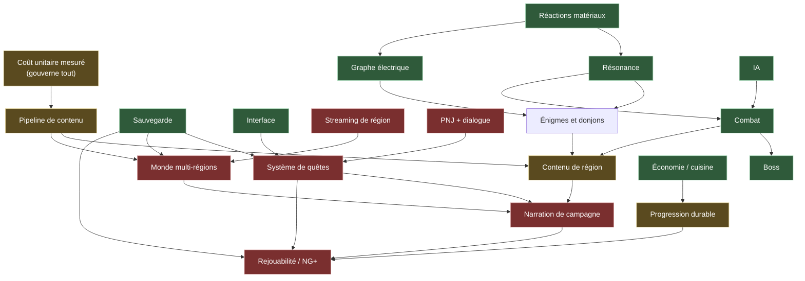

# FEUILLE DE ROUTE — de la V2 pilote à 30-50 heures

Statut : **VIVANT**. Date : 2026-08-27. Autorité : `docs/V2_PRODUCT_DOCTRINE.md`
pour l'ambition, `docs/V2_LONG_GAME_GAP_AUDIT.md` pour l'état des domaines.

Ce document ne dit pas *quoi* construire — la doctrine le dit. Il dit **dans
quel ordre**, **à quel coût**, et **ce qui gouverne la date**.

Tous les chiffres de coût viennent de `tools/mesures_socle.py`, qui les tire de
l'historique git. Ce sont des **mesures** ; leurs projections sont marquées
comme **estimations**, et il faut lire la différence.

---

## 1. Le modèle de coût, mesuré

| Grandeur | Mesure |
|---|---:|
| Chantier World V2 | 2026-08-12 → 2026-08-27, **16 jours** |
| Commits sur la période | **723** |
| dont touchant un fichier de lieu | **355 (49 %)** |
| dont infrastructure et reste | **368 (51 %)** |
| Sujets déclarés au layout | **34** |
| Lieux montés | **15** |
| Lieux déclarés non construits | **21** |
| Coût médian d'un lieu | **24 commits** (min 15, max 45) |

### Le fait qui change la stratégie

**La moitié du chantier n'est pas du contenu de lieu.** Terrain, hydrologie,
végétation, caméras, matériaux, tests, outillage : 368 commits d'un coût
**fixe, déjà payé**. Une deuxième région en hérite intégralement.

Conséquence directe, et elle est encourageante : le coût marginal d'une région
supplémentaire est **le coût de son contenu**, pas le coût de la région 1. Ce
qui a été cher n'était pas la vallée — c'était d'apprendre à faire une vallée.

### Projections — ESTIMATIONS, pas mesures

| Portée | Lieux | Commits de contenu estimés |
|---|---:|---:|
| Finir la région 1 | 21 | **~500** |
| Une région supplémentaire | ~34 | **~800** |
| Quatre régions supplémentaires | ~136 | **~3 300** |

Ces nombres supposent que les lieux restants coûtent comme les précédents. Ils
sont faux **dans les deux sens** : l'outillage s'est amélioré (moins cher),
mais les sujets faciles ont été faits en premier (plus cher). Ils valent pour
l'ordre de grandeur, pas pour la décimale.

---

## 2. L'inconnue qui domine tout : combien d'heures valent 34 lieux ?

**Nous ne le savons pas, et personne ne l'a mesuré.** Aucun temps de jeu réel
n'a jamais été relevé sur ce projet. C'est l'angle mort principal de cette
feuille de route, et il faut le dire avant les chiffres qui suivent.

Raisonnement d'ordre de grandeur, à confirmer par un vrai playtest : un point
d'intérêt occupe typiquement 2 à 5 minutes ; la traversée, le combat, le
donjon et le boss ajoutent leur part. Une région 1 **complète** vaut sans doute
**3 à 6 heures**.

Si c'est vrai, alors :

| Chemin vers 30-50 h | Ce qu'il exige |
|---|---|
| **Par le volume** | 6 à 10 régions de la densité actuelle |
| **Par la profondeur** | des systèmes qui multiplient le temps par région |
| **Mixte** | 3-4 régions + systèmes multiplicateurs |

**Le volume seul est hors de portée** : 6 à 10 régions représentent 5 000 à
8 000 commits de contenu, soit plusieurs fois tout ce qui a été fait en
seize jours. La voie mixte est la seule défendable, et c'est elle que la
suite décrit.

**Première action de la reprise** : faire mesurer un temps de parcours réel.
Le mode développement l'enregistre déjà ; il suffit qu'Istvan joue.

---

## 3. Ce qui manque, et qui est absent — pas « faible », absent

Établi par `tools/mesures_socle.py`, sondes de `class_name` et d'autoloads sur
164 classes déclarées et 6 autoloads :

| Système | État |
|---|---|
| Quêtes | **ABSENT** — aucune classe, aucun autoload |
| Dialogues | **ABSENT** |
| PNJ | **ABSENT** |
| New Game + | **ABSENT** |
| Streaming de région | **ABSENT** |
| Artisanat hors cuisine | **ABSENT** |
| Marchand / économie | **ABSENT** |
| Météo / cycle jour | **ABSENT** |

Un jeu de 30 à 50 heures **sans une seule quête, sans un seul personnage à qui
parler**, n'existe pas. C'est le gouffre principal, et il n'est pas
contournable par du contenu supplémentaire.

Ce qui est en revanche présent et nommé : cuisine, sauvegarde, résonance,
réactions de matériaux, graphe électrique, boss, IA utilitaire, inventaire,
état de jeu. Le socle systémique est là ; c'est la **couche de jeu long** qui
manque.

---

## 4. Graphe des dépendances

Rouge = absent · vert = présent et nommé · ocre = présent mais pivot de coût.

**Ce que le graphe montre.** Les branches rouges ne sont pas dispersées : elles
forment **une seule chaîne** — `PNJ → quêtes → narration → rejouabilité` —
adossée à `streaming → multi-régions`. Tout le reste du jeu est vert. Le projet
n'a pas dix trous ; il en a **deux, gros**, et ils sont adjacents.

---

## 5. Chemin critique

L'ordre ci-dessous n'est pas une préférence : chaque étape débloque
littéralement la suivante.

| # | Étape | Pourquoi elle gouverne la date |
|---|---|---|
| **0** | **Mesurer un temps de parcours réel** | sans lui, toute estimation d'heures est une opinion ; c'est la seule étape qui coûte quelques minutes et change tout le reste |
| **1** | **Finir la région 1** (21 lieux) | c'est ce qui calibre le coût unitaire pour de bon, et c'est la seule région dont l'infrastructure est déjà payée |
| **2** | **PNJ + dialogue** | brique la plus basse de la chaîne rouge ; rien de la campagne longue n'existe sans elle |
| **3** | **Système de quêtes** | dépend de 2, de la sauvegarde et de l'UI ; c'est lui qui transforme des lieux en campagne |
| **4** | **Streaming + multi-régions** | dépend de la sauvegarde et du pipeline ; sans lui, le volume est plafonné à une vallée |
| **5** | **Région 2** | première vraie mesure du coût marginal — la prédiction du §1 se vérifie ou s'effondre ici |
| **6** | **Progression durable + rejouabilité** | dépend de 3 et 5 ; c'est ce qui porte les 80-120 h et les 200 h+ |

**Étape 0 est sur le chemin critique et coûte cinq minutes.** C'est la meilleure
affaire de cette feuille de route, et elle attend seulement lundi.

L'étape 2 est le vrai premier chantier : elle n'a **aucune** dépendance
absente, elle est purement additive, et elle débloque à elle seule trois nœuds
rouges sur six.

---

## 6. Trois scénarios de portée

### A — Ambitieux : 30-50 h, six régions
Volume complet, quêtes, narration, rejouabilité. **~5 000 commits de contenu**
au rythme mesuré, plus les systèmes absents. Défendable seulement si le coût
marginal d'une région s'avère très inférieur à celui de la région 1 — ce que
l'étape 5 seule peut établir. **Ne pas s'y engager avant l'étape 5.**

### B — Réaliste : 15-25 h, trois régions, systèmes complets *(recommandé)*
Trois régions, quêtes et PNJ, progression durable, rejouabilité légère.
**~2 000 commits de contenu.** Sacrifie la moitié de l'ambition affichée mais
livre un jeu **entier**, avec sa boucle complète et son identité intacte.

Recommandé parce que c'est le seul scénario où chaque étape est vérifiable au
moment où on la franchit, et où un arrêt en cours de route laisse quand même
un jeu jouable.

### C — Réduit : 6-10 h, une région, systèmes complets
Région 1 finie, quêtes légères, une campagne courte mais entière.
**~700 commits.** Sacrifie le volume, garde tout le reste. C'est le repli
honnête si le temps manque — et c'est aussi, par construction, **l'étape 1 à 3
du scénario B**. Les deux ne divergent qu'après.

**Recommandation : viser B, en construisant C d'abord.** Aucune décision prise
avant l'étape 5 ne coûte quoi que ce soit à l'un ou à l'autre.

---

## 7. Ce que cette feuille de route n'autorise pas

`GO_V2_3_B_LOT2` reste **FALSE**. Aucune construction, aucune retouche
artistique, aucune release. La tranche exécutable est décrite dans
`docs/V2_REGION1_VERTICAL_SLICE.md` et attend l'autorisation du lead.

---

## 8. Ce qui reste NON VÉRIFIÉ dans ce document

Il faut le dire aussi clairement que le reste :

- **Aucun temps de jeu réel n'a été mesuré.** Les heures du §2 sont un
  raisonnement, pas une observation.
- Le coût marginal d'une région 2 est une **hypothèse** ; il ne sera mesuré
  qu'à l'étape 5.
- Les commits ne sont pas une unité de travail : ils mesurent une cadence, pas
  un effort. Ils servent ici de **proxy comparatif** entre lieux d'un même
  projet, ce qui est leur seul usage légitime.
- Le conteneur de développement ne peut mesurer ni la fluidité, ni le temps
  (ISS-072). Toute affirmation de performance attend une vraie machine.
