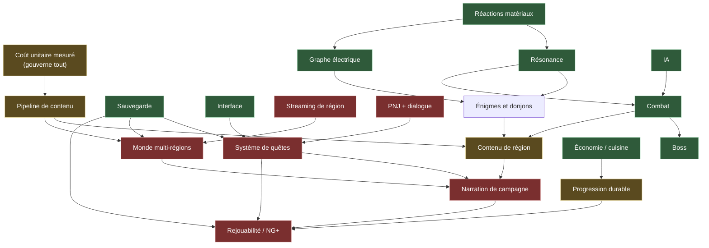

# FEUILLE DE ROUTE — de la V2 pilote à 30-50 heures

Statut : **VIVANT**. Date : 2026-08-27. Autorité : `docs/V2_PRODUCT_DOCTRINE.md`
pour l'ambition, `docs/V2_LONG_GAME_GAP_AUDIT.md` pour l'état des domaines.

Ce document ne dit pas *quoi* construire — la doctrine le dit. Il dit **dans
quel ordre**, **à quel coût**, et **ce qui gouverne la date**.

Tous les chiffres de coût viennent de `tools/mesures_socle.py`, qui les tire de
l'historique git. Ce sont des **mesures** ; leurs projections sont marquées
comme **estimations**, et il faut lire la différence.

---

## 1. Ce que l'historique montre — des INDICATEURS D'ACTIVITÉ, pas des coûts

> **CORRECTION DU 2026-08-27.** Ce chapitre présentait les commits comme un
> « modèle de coût ». C'était abusif. **Un commit mesure une cadence de
> travail, pas un effort** : il dépend de la façon dont on découpe, des
> allers-retours de revue, des reprises. Deux lieux à 24 commits peuvent
> avoir coûté du simple au triple.
>
> Ils restent utiles comme **indicateur d'activité comparatif** entre lieux
> d'un même projet, ce qui est leur seul usage légitime. Les grandeurs qui
> mesureraient vraiment un coût sont listées au §1.3 — et **aucune n'est
> encore relevée**.

| Grandeur | Mesure |
|---|---:|
| Chantier World V2 | 2026-08-12 → 2026-08-27, **16 jours** |
| Commits sur la période | **723** |
| dont touchant un fichier de lieu | **355 (49 %)** |
| dont infrastructure et reste | **368 (51 %)** |
| Sujets déclarés au layout | **34** |
| Lieux montés | **15** |
| Lieux déclarés non construits | **21** |
| Coût médian d'un lieu | **24 commits** (min 15, max 45) |

### Le fait qui change la stratégie

**La moitié de l'activité ne porte pas sur un lieu.** Terrain, hydrologie,
végétation, caméras, matériaux, tests, outillage : 368 commits.

> **CORRECTION DU 2026-08-27, exigée par l'audit.** Ce paragraphe affirmait
> qu'une deuxième région « en hérite intégralement ». **C'est faux, et
> l'audit le démontre.** Une part de cette infrastructure est **spécifique à
> Néris**, pas générique :
>
> - `WorldV2Heightmap._fields()` encode le relief en constantes réglées à la
>   main pour cette vallée-ci ; l'emprise de 512 m y est **codée en dur**.
> - `WorldV2Layout.CANONICAL_POI_IDS` **refuse** tout POI hors des 31
>   littéraux de Néris.
> - L'anneau de 36 gardes `unclimbable` est contractuellement sans brèche.
> - Trois emprises divergentes (235,0 / 233,0 / 246,0) et quatre tables par
>   région vivent en GDScript.
>
> Ce qu'une région 2 hérite réellement : les **outils** (chaîne Blender,
> portails, filets, gel), les **conventions**, et la partie générique des
> bâtisseurs. Ce qu'elle n'hérite pas : le relief, les limites, et plusieurs
> règles qui devront d'abord être **extraites** en format de région. Ce
> travail d'extraction n'est ni mesuré ni commencé.

Ce qui reste vrai, et qui est encourageant : une part notable de l'activité a
servi à **apprendre à faire une vallée**, et cet apprentissage-là ne se repaie
pas. Mais dire « l'infrastructure est payée » serait un faux vert de plus.

### 1.2 Projections — ESTIMATIONS d'activité, pas de coût

| Portée | Lieux | Commits de contenu estimés |
|---|---:|---:|
| Finir la région 1 | 21 | **~500** |
| Une région supplémentaire | ~34 | **~800** |
| Quatre régions supplémentaires | ~136 | **~3 300** |

Ces nombres supposent que les lieux restants coûtent comme les précédents. Ils
sont faux **dans les deux sens** : l'outillage s'est amélioré (moins cher),
mais les sujets faciles ont été faits en premier (plus cher). Ils valent pour
l'ordre de grandeur, pas pour la décimale.

---

### 1.3 Ce qu'il faudrait mesurer pour parler de COÛT — et qui ne l'est pas

Aucune des grandeurs ci-dessous n'est relevée aujourd'hui. Les nommer, c'est
dire à quel point le §1.1 est un proxy et non une mesure.

| Grandeur | Ce qu'elle capture | Comment la relever |
|---|---|---|
| **Temps écoulé par sujet** | la durée réelle du chantier d'un lieu, reprises comprises | horodatage du premier et du dernier commit touchant ses fichiers |
| **Durée machine** | ce que coûtent Blender, l'export, l'import et les captures | chronométrer les scripts de chaîne, journal daté |
| **Itérations avant acceptation** | le coût caché des reprises — le signal le plus utile de tous | compter les passes correctives par sujet (la grotte en a eu huit) |
| **Temps de validation** | ce que coûte de PROUVER, par opposition à construire | durée de `validate_fast.sh`, des portails, des captures |
| **Volume d'assets** | ce que le dépôt porte et ce qu'un joueur télécharge | octets et nombre de fichiers sous `assets/` et `evidence/` |

**L'itération est probablement la grandeur dominante.** L'historique du dépôt
le suggère fortement : la grotte a traversé R2a-3.1 à R2a-3.5.8, soit huit
passes correctives nommées. Un lieu accepté du premier coup et un lieu repris
huit fois portent le même nombre de commits à quelques unités près, et n'ont
rien coûté de comparable.

**À faire avant de citer un coût.** Tant que ces cinq grandeurs ne sont pas
relevées, toute phrase de ce document contenant le mot « coût » désigne un
indicateur d'activité, et il faut la lire ainsi.

## 2. L'inconnue qui domine tout : combien d'heures valent 34 lieux ?

**Nous ne le savons pas, et personne ne l'a mesuré.** Aucun temps de jeu réel
n'a jamais été relevé sur ce projet. C'est l'angle mort principal de cette
feuille de route, et il faut le dire avant les chiffres qui suivent.

Raisonnement d'ordre de grandeur, à confirmer par un vrai playtest : un point
d'intérêt occupe typiquement 2 à 5 minutes ; la traversée, le combat, le
donjon et le boss ajoutent leur part. Une région 1 **complète** vaut sans doute
**3 à 6 heures**.

Si c'est vrai, alors :

| Chemin vers 30-50 h | Ce qu'il exige |
|---|---|
| **Par le volume** | 6 à 10 régions de la densité actuelle |
| **Par la profondeur** | des systèmes qui multiplient le temps par région |
| **Mixte** | 3-4 régions + systèmes multiplicateurs |

**Le volume seul est hors de portée** : 6 à 10 régions représentent 5 000 à
8 000 commits de contenu, soit plusieurs fois tout ce qui a été fait en
seize jours. La voie mixte est la seule défendable, et c'est elle que la
suite décrit.

**Première action de la reprise** : faire mesurer un temps de parcours réel.
Le mode développement l'enregistre déjà ; il suffit qu'Istvan joue.

> **CE QUE LE PARCOURS DE LUNDI MESURERA, ET CE QU'IL NE MESURERA PAS.**
> Il portera sur la **boucle actuelle** : la traversée minimale de la vallée,
> l'entrée dans le donjon, les transitions, le retour. C'est exactement ce
> qu'il faut pour valider ISS-073 et donner un premier ordre de grandeur.
>
> Il **ne permettra pas** d'extrapoler une campagne de 30-50 h. Le monde livré
> ne contient ni ennemi, ni quête, ni PNJ, et 21 de ses 34 lieux ne sont pas
> construits. Multiplier son temps de parcours par un facteur inventé serait
> exactement le genre de chiffre que ce dépôt s'interdit.

---

## 3. Ce qui manque, et qui est absent — pas « faible », absent

Établi par `tools/mesures_socle.py`, sondes de `class_name` et d'autoloads sur
164 classes déclarées et 6 autoloads :

| Système | État |
|---|---|
| Quêtes | **ABSENT** — aucune classe, aucun autoload |
| Dialogues | **ABSENT** |
| PNJ | **ABSENT** |
| New Game + | **ABSENT** |
| Streaming de région | **ABSENT** |
| Artisanat hors cuisine | **ABSENT** |
| Marchand / économie | **ABSENT** |
| Météo / cycle jour | **ABSENT** |

Un jeu de 30 à 50 heures **sans une seule quête, sans un seul personnage à qui
parler**, n'existe pas. C'est le gouffre principal, et il n'est pas
contournable par du contenu supplémentaire.

Ce qui est en revanche présent et nommé : cuisine, sauvegarde, résonance,
réactions de matériaux, graphe électrique, boss, IA utilitaire, inventaire,
état de jeu. Le socle systémique est là ; c'est la **couche de jeu long** qui
manque.

---

## 4. Graphe des dépendances

Rouge = absent · vert = présent et nommé · ocre = présent mais pivot de coût.

**Ce que le graphe montre.** Les branches rouges ne sont pas dispersées : elles
forment **une seule chaîne** — `PNJ → quêtes → narration → rejouabilité` —
adossée à `streaming → multi-régions`. Tout le reste du jeu est vert. Le projet
n'a pas dix trous ; il en a **deux, gros**, et ils sont adjacents.

---

## 5. Chemin critique

L'ordre ci-dessous n'est pas une préférence : chaque étape débloque
littéralement la suivante.

> **CORRECTION DU 2026-08-27, après l'audit des 18 domaines.** Cette table
> plaçait la mesure d'un parcours réel en étape 0. C'était faux, et l'audit
> l'a montré : **on ne peut pas mesurer une campagne qu'on ne peut pas
> jouer.** Le build livré n'a aucune porte de scène vers le donjon (vérifié à
> la main), donc le parcours à mesurer n'existe pas encore. La réparation de
> la boucle passe devant. C'est une correction fondée sur une preuve, pas un
> recul.

| # | Étape | Pourquoi elle gouverne la date |
|---|---|---|
| **0** | **Refermer la boucle** — une `SceneDoor` vers le donjon dans World V2, et les **quatre** retours qui pointent encore vers `ValleyWorld.tscn` (V1) redressés | sans elle, donjon, boss et victoire sont inatteignables et **aucune** durée de campagne n'est mesurable. Coût faible, effet total : c'est la meilleure affaire de tout l'audit |
| **1** | **Mesurer un temps de parcours réel** | possible seulement après 0 ; toute estimation d'heures reste une opinion tant qu'elle n'a pas eu lieu |
| **2** | **Finir la région 1** (21 lieux) | c'est ce qui calibre le coût unitaire pour de bon, sur la seule région dont le relief et les limites existent déjà |
| **3** | **PNJ + dialogue** | brique la plus basse de la chaîne rouge ; rien de la campagne longue n'existe sans elle |
| **4** | **Système de quêtes** | dépend de 2, de la sauvegarde et de l'UI ; c'est lui qui transforme des lieux en campagne |
| **5** | **Streaming + multi-régions** | dépend de la sauvegarde et du pipeline ; sans lui, le volume est plafonné à une vallée |
| **6** | **Région 2** | première vraie mesure du coût marginal — la prédiction du §1 se vérifie ou s'effondre ici |
| **7** | **Progression durable + rejouabilité** | dépend de 3 et 5 ; c'est ce qui porte les 80-120 h et les 200 h+ |

**Les étapes 0 et 1 coûtent, ensemble, moins d'une journée** — une porte,
quatre constantes, puis cinq minutes de jeu lundi. Elles débloquent la mesure
de tout le reste. Rien d'autre dans cette feuille de route n'a ce rapport
effet/coût.

L'étape 3 est le vrai premier chantier de contenu : elle n'a **aucune** dépendance
absente, elle est purement additive, et elle débloque à elle seule trois nœuds
rouges sur six.

---

## 6. Trois scénarios de portée

### A — Ambitieux : 30-50 h, six régions
Volume complet, quêtes, narration, rejouabilité. **~5 000 commits de contenu**
au rythme mesuré, plus les systèmes absents. Défendable seulement si le coût
marginal d'une région s'avère très inférieur à celui de la région 1 — ce que
l'étape 6 seule peut établir. **Ne pas s'y engager avant l'étape 6.**

### B — Repli éventuel : 15-25 h, trois régions, systèmes complets
Trois régions, quêtes et PNJ, progression durable, rejouabilité légère.
**~2 000 commits de contenu.** Sacrifie la moitié de l'ambition affichée mais
livre un jeu **entier**, avec sa boucle complète et son identité intacte.

> **CORRECTION DU 2026-08-27.** Ce scénario était marqué « recommandé ». Il
> ne l'est plus : **la cible canonique reste 30-50 h / 80-120 h / 200 h+**,
> fixée par `docs/V2_PRODUCT_DOCTRINE.md`. Réduire l'ambition est une
> décision de produit qui appartient à Istvan, pas une conclusion technique
> que je puisse tirer d'un audit.
>
> Il reste décrit ici comme **repli documenté**, à activer seulement sur
> décision explicite. Sa propriété utile : chaque étape y est vérifiable au
> moment où on la franchit, et un arrêt en cours de route laisse quand même
> un jeu jouable.

### C — Réduit : 6-10 h, une région, systèmes complets
Région 1 finie, quêtes légères, une campagne courte mais entière.
**~700 commits.** Sacrifie le volume, garde tout le reste. C'est le repli
honnête si le temps manque — et c'est aussi, par construction, **les étapes 0 à 4
du scénario B**. Les deux ne divergent qu'après.

**La cible reste A — 30-50 h**, conformément à la doctrine. B et C sont des
replis documentés, activables sur décision d'Istvan et sur elle seule.

Le fait utile, et il vaut pour les trois : **les étapes 0 à 4 sont communes.**
Refermer la boucle, mesurer, finir la région 1, poser PNJ et quêtes — rien de
tout cela ne dépend du scénario retenu. Aucune décision de portée n'a besoin
d'être prise avant l'étape 6, où le coût marginal d'une région sera enfin
mesuré. **Ne pas trancher maintenant ne coûte rien ; trancher maintenant
coûterait de le faire sans mesure.**

---

## 7. Ce que cette feuille de route n'autorise pas

`GO_V2_3_B_LOT2` reste **FALSE**. Aucune construction, aucune retouche
artistique, aucune release. La tranche exécutable est décrite dans
`docs/V2_REGION1_VERTICAL_SLICE.md` et attend l'autorisation du lead.

---

## 8. Ce qui reste NON VÉRIFIÉ dans ce document

Il faut le dire aussi clairement que le reste :

- **Aucun temps de jeu réel n'a été mesuré.** Les heures du §2 sont un
  raisonnement, pas une observation.
- Le coût marginal d'une région 2 est une **hypothèse** ; il ne sera mesuré
  qu'à l'étape 5.
- Les commits ne sont pas une unité de travail : ils mesurent une cadence, pas
  un effort. Ils servent ici de **proxy comparatif** entre lieux d'un même
  projet, ce qui est leur seul usage légitime.
- Le conteneur de développement ne peut mesurer ni la fluidité, ni le temps
  (ISS-072). Toute affirmation de performance attend une vraie machine.
